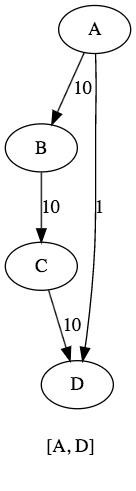
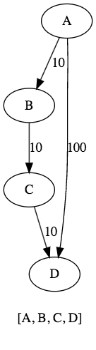

## BSF
## DFS

## Iterative deepening DFS
- Very important in AI and robotics
- BFS: very good for local searches BUT it is very very memory consuming
- DFS: can be implemented easily with recursion BUT it keeps going further and futher
- DFS is very memory freindly
- Question: can be construct a search algorithm that inherits the advantages of both DFS and BFS?
- Yes, it is the iterative deepening DFS algorithm!!!

------

- It visits the nodes in the search tree in the same order as DFS, but the cumulative order in which nodes are first visited is effectively breadth-first
- Keep going deeper and deeper in the given tree with DFS on each iteration
- The time complexity of IDDFS in well-balanced trees works out to be the same as DFS
- Disadvantage: we keep recomputing the same problem over and over again ... BUT not so dramatic **O(cN) ~ O(N)** if c is a constant !!!

```java
import java.util.Stack;

public class IDDFS {

  private Node targetNode;
  private boolean isTargetFound;

  public IDDFS(Node targetNode) {
    this.targetNode = targetNode;
  }

  public void runDeepeningSearch(Node startNode) {

    int depth = 0;

    while(!isTargetFound) {
      System.out.println();
      dfs(startNode,depth);
      depth++;
      System.out.println();
    }
  }

  public void dfs(Node startNode, int depth) {
    Stack<Node> stack = new Stack<>();
    startNode.setDepthLevel(0);
    stack.push(startNode);

    while(!stack.isEmpty()) {
      Node actualNode = stack.pop();
      System.out.print(actualNode + " ");

      if(actualNode.getName().equals(targetNode.getName())) {
        System.out.println("\nNode has been found .... ");
        this.isTargetFound = true;
        return;
      }

      // contine and finish the rest of the stack
      // to explore other upper nodes
      if(actualNode.getDepthLevel() >= depth) {
        continue;
      }

      for(Node node : actualNode.getAdjacenciesList()) {
        node.setDepthLevel(actualNode.getDepthLevel() + 1);
        stack.push(node);
      }
    }
  }

  public static void main(String[] args) {
    Node v1 = new Node("A");
    Node v2 = new Node("B");
    Node v3 = new Node("C");
    Node v4 = new Node("D");
    Node v5 = new Node("E");

    v1.addNeighbour(v2);
    v1.addNeighbour(v3);
    v3.addNeighbour(v4);
    v4.addNeighbour(v5);

    IDDFS iddfs =new IDDFS(v5); // target = E
    iddfs.runDeepeningSearch(v1); // start from node A, root
  }
}
/*
A

A C B

A C D B

A C D E
Node has been found ....
*/
```


------

## A* Search
- Very important in AI!!!
- Widely used in pathfinding and graph traversal
- Can solve pathfinding problems in games
- However, in practical travel-routing systems, it is generally outperformed by algorithms which can pre-process the graph to attain better performance (Dijkstra or BFS)
- It is like Dijkstra: A* achieves better time performance by using heuristics
- It uses a knowledge-plus-heuristic cost function of node x (usually denoted f(x)) to determine the order in which the search visits nodes in the tree. the cost function is a sum of two functions:
  - g(x) the known distance from the starting node to the current node x
  - h(x) "heuristic estimate" of the distance from x to the goal
- Note: if h(x)= 0 -> that is the common shortest path problem
- It is like the clssic Dijkstra method, but here we make decisions according to the **f(x)=g(x) + h(x)** function
- Why is it good?
- If there are obstacles in the way between us and the final destination, A* helps to find the best path possible
- Greedy best first search may lead us to dead ends instead !!!
- Manhattan distance: we usually use this kind of heuristic
  - Keep tracking what is the distance between us and the goal
  - NOT the Euclidean distance!!!

-------


```java
public class Edge {

  private double cost;
  private Node targetNode;

  public Edge(Node targetNode, double cost) {
    this.cost = cost;
    this.targetNode = targetNode;
  }

  public double getCost() { return cost; }
  public void setCost(double cost) { this.cost = cost; }

  public Node getTargetNode() { return targetNode; }
  public void setTargetNode(Node targetNode) { this.targetNode = targetNode; }
}

```

```java
public class Node implements Comparable<Node>{

  private String value;
  private List<Edge> adjacenciesList;
  private Node parentNode;

  // G(n) is exact cost of the path from the starting point to any vertex n
  // h(n) represents the heuristic estimated cost from vertex n to the goal
  private double gScore; // g is guess, and h is heuristic
  private double fScore; // f = g + h , h = f - g
  private int x;
  private int y;


  public Node(String value) {
    this.value = value;
    this.adjacenciesList = new ArrayList<Edge>();
  }

  public void addNeighbour(Edge edge) { this.adjacenciesList.add(edge); }

  public String getValue() { return value; }
  public void setValue(String value) { this.value = value; }

  public double getFScore() { return fScore; }
  public void setFScore(double fScore) { this.fScore = fScore; }

  public double getGScore() { return gScore; }
  public void setGScore(double gScore) { this.gScore = gScore; }

  public Node getParentNode() { return parentNode; }
  public void setParentNode(Node parentNode) { this.parentNode = parentNode; }

  public int getX() { return x; }
  public void setX(int x) { this.x = x; }

  public int getY() { return y; }
  public void setY(int y) { this.y = y; }

  public List<Edge> getAdjacenciesList() { return adjacenciesList; }

  @Override
  public String toString() { return this.value; }

  @Override
  public int compareTo(Node otherNode) {
    return Double.compare(this.fScore, otherNode.getFScore());
  }
}
```

```java
import java.util.ArrayList;
import java.util.List;
import java.util.PriorityQueue;
import java.util.HashSet;
import java.util.Set;
import java.util.Collections;

// kinda like Dijkstra
public class AStarSearch {

  public void AStarSearch(Node sourceNode, Node goalNode) {

    Set<Node> exploredNodes = new HashSet<>();

    PriorityQueue<Node> unExploredNodesQueue = new PriorityQueue<>();
    sourceNode.setGScore(0); // initilize G-Score to be 0
    unExploredNodesQueue.add(sourceNode);
    boolean isFound = false;

    while(!unExploredNodesQueue.isEmpty() && !isFound) {

      Node currentNode = unExploredNodesQueue.poll();
      exploredNodes.add(currentNode);

      if(currentNode.getValue().equals(goalNode.getValue()))
        isFound = true;

      for(Edge e : currentNode.getAdjacenciesList()) {
        Node childNode = e.getTargetNode();
        double cost = e.getCost();
        double tempGScore = currentNode.getFScore() + cost;
        double tempFScore = tempGScore + heuristic(childNode, goalNode);

        // not better --> continue
        if(exploredNodes.contains(childNode) && (tempFScore >= childNode.getFScore())) {
          continue;
        } // better solution
        else if(!unExploredNodesQueue.contains(childNode) || (tempFScore < childNode.getFScore())) {
          childNode.setParentNode(currentNode);
          childNode.setGScore(tempGScore);
          childNode.setFScore(tempFScore);

          if(unExploredNodesQueue.contains(childNode))
            unExploredNodesQueue.remove(childNode);

          unExploredNodesQueue.add(childNode);
        }
      }
    }
  }
  // Manhattan distance
  private double heuristic(Node node1, Node node2) {
    return Math.abs(node1.getX() - node2.getX()) + Math.abs(node2.getY() - node1.getY());
  }

  public List<Node> getPath(Node targetNode) {
    List<Node> pathList = new ArrayList<>();

    for(Node node = targetNode; node != null; node = node.getParentNode())
      pathList.add(node);

    Collections.reverse(pathList);
    return pathList;
  }

  public static void main(String[] args) {
    Node node1 = new Node("A");
    Node node2 = new Node("B");
    Node node3 = new Node("C");
    Node node4 = new Node("D");

    node1.addNeighbour(new Edge(node2, 10));
    node1.addNeighbour(new Edge(node4, 100));
    node2.addNeighbour(new Edge(node3, 10));
    node3.addNeighbour(new Edge(node4, 10));

    AStarSearch aStar = new AStarSearch();
    aStar.AStarSearch(node1, node4);

    List<Node> path = aStar.getPath(node4);
    System.out.println(path);
  }
}
```
     
