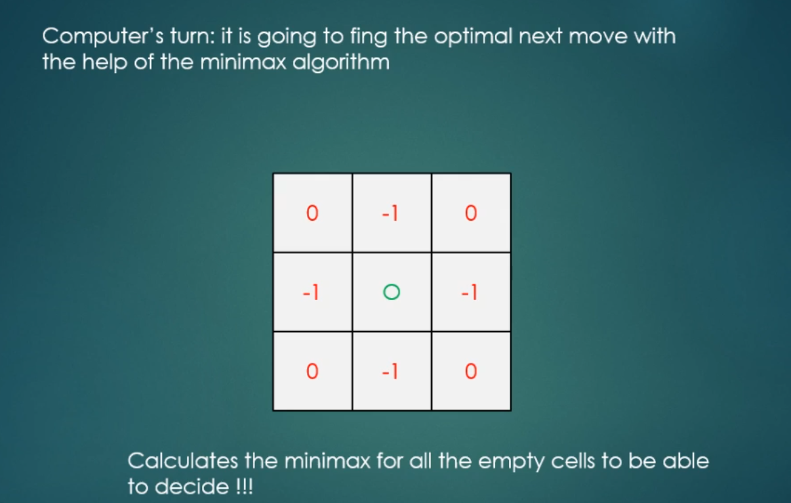

# Minimax

## Minimax Principle
- Minimax is a decision rule in decision theory and game theory
- Used for minimizing the possible loss for a maximum loss scenario
- Can be used in two-player games -> Tic tac toe !!!
- Minimax algorithm is a recursive algorithm for choosing the next move in a game
  - For example with two players
- A value is associated with each position or state of the game
  -  +1: win situation
  -   0 : neutral situation
  -  -1: lose situation
- We construct a tree like structure: with as many branches as the number of possible outcomes

-----

- For small games such as Tic Tac Toe: we can construct the full tree at the beginning: only 9! different scenarios
- But for chess it would be impossible because of the enormuous number of different scenarios ... have to use heuristics
- For example, the cess computer Deep Blue looked ahead at least 12 plies, then applied a heuristic evaluation function -> this function prediect whehter that situation is a +1 win situation or 0 or -1 !!!

-------------


--------


--------
- Leaf node, we choose maximum(-1 vs 1) --> 1


--------
- Leaf node, we choose maximum(-1 vs 0) --> 0


--------
- We choose the mimimum (1 vs 0) --> 0


--------
- And consider this left part of the tree is visited
- Move to the next branch


--------
- Leaf node, we choose maximum(1 vs -1) --> 1
- Only a single node --> choose 1


-----
- Same thing


-----
- We have 0, 1 and 0, we choose the maximum --> 1


-----


----
- How does it look like?


-------


------


---------

## Pruning

### Alpha-beta pruning
- What is the problem with minimax algorithm ?
- The game tree amy be enormous: there may be some branches we should not visit ....
  - Like there are 2's X on the row, and we should consider to put O in that same row
- These pruning can reduce the time complexity of our minimax algorithm (for example chess)
- Iterative deepening  is usually used in conjunction with alpha-beta so that a reasonably good move can be returned even if the algorithm is interrupted before it has finished execution

-----


-----
- We have to assign two extra variable to every node: alpha and beta
- **Alpha**: best already explored option along path to the root for maximizer
  - Only maximizer nodes can change its value !!! the maximum value the maximizer can receive
    - Initialized to minus infinity
- **Beta**: best already explored option along path to the root for minimizer
  - Only minimizer nodes can change its value !!! The minimum socre the minimizer can receive
    - Initialized to positive infinity
- When alpha is greater or equal to beta -> We can prune that branch !!!

------
- We know that 5 is less than the Beta --> update Beta


------
- But we see that Alpha is less than Beta --> not able to prune
- --> have to visit the right child (leaf) which is 6
- Because this is the minimizer, that's why the value is going to be 5


-------
- At this state, we want to maximize Alpha
- Because 5 is greater than -inf
- That's why we change value of alpha to 5


-------
- Go to the right most children
- and because children always inherit Alpha and Beta from the parent
- That's why we have Alpha and Beta here


-------
- Vist child node (leaf) 4
- Since 4 is less than Beta (inf) --> update Beta to 4
- Now, we see that Alpha is greater Beta
- ---> We can prune cause we don't care about right most child


------
- Since 5 is greater than 4 --> choose 5


------
- At this state, we want to make Beta as small as possible
- --> inf vs 5 --> update Beta to 5


-------
- Because this is the minimize layer
- --> We want Beta to be small as small as possible
- Since 8 > 5 --> no update for Beta
- and 9 > 5 --> no update for Beta
- --> 8 > 9 --> choose 8


-------
- We backtrack
- At this, state, we want to make Alpha as big as possible (maximize layer)
- --> 8 > -inf --> update value of Alpha to 8


-------
- Since Alpha is greater than Beta ( 8 > 5)
- --> we can prune


-------
- This is the minimum layer
- --> 5 < 8 --> choose 5


-------
- Since root node is the maximize layer --> Alpha as big as possible
- --> 5 > -inf --> 5


-------
- Same thing for the right children of the root node


------
- Root node is going to the 5


------
- This is the optimal move!!!


---------

## Tic Tac Toe Game



------

```java
public class Constants {
  private Constants() { }
  public static final int BOARD_SIZE = 3;
}
```

```java
public class Cell {

  private int x; // row: 0,1,2
  private int y; // col: 0,1,2
  private int minimaxValue;

  public Cell(int x, int y) {
    this.x = x;
    this.y = y;
  }

  public void setX(int x) { this.x = x; }
  public int getX() { return x; }

  public void setY(int y) { this.y = y; }
  public int getY() { return y; }

  public void setMinimaxValue(int minimaxValue) { this.minimaxValue = minimaxValue; }
  public int getMinimaxValue() { return minimaxValue; }

  @Override
  public String toString(){ return "(" + this.x + "," + this.y + ")"; }
}
```

```java
public enum Player {

  COMPUTER("X"), USER("O"), NONE("-");

  private Player(String text) {
    this.text = text;
  }

  private final String text;

  @Override
  public String toString() { return this.text; }
}
```

```java
import java.util.ArrayList;
import java.util.List;
import java.util.Scanner;

public class Board {

  private List<Cell> emptyCells;
  private Scanner scanner;
  private Player[][] board;
  private List<Cell> rootValues;

  public Board() {
    initializeBoard();
  }

  private void initializeBoard() {
    this.rootValues = new ArrayList<>();
    this.scanner = new Scanner(System.in);
    this.board = new Player[Constants.BOARD_SIZE][Constants.BOARD_SIZE];
  }

  public boolean isRunning() {

    if(isWinning(Player.COMPUTER)) return false;
    if(isWinning(Player.USER)) return false;
    if(getEmptyCells().isEmpty()) return false;

    return true;
  }

  public List<Cell> getEmptyCells() {
    emptyCells = new ArrayList<>();

    for(int i = 0; i < Constants.BOARD_SIZE; i++)
      for(int j = 0; j < Constants.BOARD_SIZE; j++)
        if(board[i][j] == Player.NONE)
          emptyCells.add(new Cell(i,j));

    return emptyCells;
  }

  public void move(Cell cell, Player player) {
    this.board[cell.getX()][cell.getY()] = player;
  }

  public Cell getBestMove() {
    int max = Integer.MIN_VALUE;
    int best = Integer.MIN_VALUE;

    for(int i = 0; i < rootValues.size(); i++) {
      if(max < rootValues.get(i).getMinimaxValue()) {
        max = rootValues.get(i).getMinimaxValue();
        best = i;
      }
    }

    return rootValues.get(best);
  }

  public void makeUserInput() {
    System.out.println("User's move:");
    int x = scanner.nextInt();
    int y = scanner.nextInt();
    Cell cell = new Cell(x,y);
    move(cell, Player.USER);
  }

  public void displayBoard() {
    System.out.println();

    for(int i = 0; i <  Constants.BOARD_SIZE; i++) {
      for(int j = 0; j < Constants.BOARD_SIZE; j++) {
        System.out.print(board[i][j] + " ");
      }
      System.out.println();
    }
    System.out.println("#########################");
  }

  public int returnMin(List<Integer> list) {
    int min = Integer.MAX_VALUE;
    int index = Integer.MIN_VALUE;

    for(int i = 0; i < list.size(); i++) {
      if(list.get(i) < min) {
        min = list.get(i);
        index = i;
      }
    }

    return list.get(index);
  }

  public int returnMax(List<Integer> list) {
    int max = Integer.MIN_VALUE;
    int index = Integer.MIN_VALUE;

    for(int i = 0; i < list.size(); i++) {
      if(list.get(i) > max) {
        max = list.get(i);
        index = i;
      }
    }

    return list.get(index);
  }

  public void callMinimax(int depth, Player player) {
    rootValues.clear();
    minimax(depth, player);
  }

  public int minimax(int depth, Player player) {
    if(isWinning(Player.COMPUTER)) return +1;
    if(isWinning(Player.USER)) return -1;

    List<Cell> availabelCells = getEmptyCells();

    if(availabelCells.isEmpty()) return 0; //draw

    List<Integer> scores = new ArrayList<>();

    for(int i = 0; i < availabelCells.size(); i++) {
      Cell point = availabelCells.get(i);

      if(player == Player.COMPUTER) {
        move(point, Player.COMPUTER);
        int currentScore = minimax(depth + 1, Player.USER);
        scores.add(currentScore);

        // after it backtrack
        // set the minimax value for each of empty cells at the current board state
        if(depth == 0) {
          point.setMinimaxValue(currentScore);
          rootValues.add(point);
        }
      } else if(player == Player.USER) {
          move(point, Player.USER);
          scores.add(minimax(depth + 1, Player.COMPUTER));
      }

      board[point.getX()][point.getY()] = Player.NONE; // set it back to normal
    }

    if(player == Player.COMPUTER) {
      return returnMax(scores);
    }
    return returnMin(scores);
  }

  public void setupBoard() {
    for(int i = 0; i < Constants.BOARD_SIZE; i++)
      for(int j = 0; j < Constants.BOARD_SIZE; j++)
        board[i][j] = Player.NONE;
  }


  public boolean isWinning(Player player) {
    // checking diagonal
    if(board[0][0] == player && board[1][1] == player && board[2][2] == player)
      return true;
    // checking diagonal
    if(board[0][0] == player && board[1][1] == player && board[2][2] == player)
      return true;

    for(int i = 0; i < Constants.BOARD_SIZE; i++) {
      // Checking the row
      if(board[i][0] == player && board[i][1] == player && board[i][2] == player)
        return true;
      // Checking the column
      if(board[0][i] == player && board[1][i] == player && board[2][i] == player)
        return true;
    }
    return false;
  }

  public Scanner getScanner() { return scanner; }
  public List<Cell> getRootValues() { return rootValues; }

}
```

```java
import java.util.Random;

public class Game {

  private Board board;
  private Random random;

  public Game() {
    initializeGame();
    displayBoard();
    makeFirstMove();
    playGame();
    checkStatus();
  }

  private void playGame() {
    while(this.board.isRunning()) {
      System.out.println("User move: ");
      Cell userCell = new Cell(board.getScanner().nextInt(), board.getScanner().nextInt());

      this.board.move(userCell, Player.USER);
      displayBoard();

      if(!this.board.isRunning())
        break;

      this.board.callMinimax(0, Player.COMPUTER);

      for(Cell cell : this.board.getRootValues())
        System.out.println("Cell value: " + cell + ", minimaxValue = " + cell.getMinimaxValue());

      this.board.move(board.getBestMove(), Player.COMPUTER);
      displayBoard();
    }
  }

  private void makeFirstMove() {
    System.out.println("Who starts? 1 - Computer ; 2 - User");
    int choice = board.getScanner().nextInt();

    if(choice == 1) {
      int xRandom = random.nextInt(Constants.BOARD_SIZE);
      int yRandom = random.nextInt(Constants.BOARD_SIZE);
      Cell cell = new Cell(xRandom, yRandom);
      this.board.move(cell, Player.COMPUTER);
      displayBoard();
    }
  }

  private void displayBoard() {
    this.board.displayBoard();
  }

  private void checkStatus() {
    if(board.isWinning(Player.COMPUTER)) {
      System.out.println("Computer has won!");
    } else if(board.isWinning(Player.USER)) {
      System.out.println("User has won!");
    } else
      System.out.println("It's a draw!!!");
  }

  private void initializeGame() {
    this.board = new Board();
    this.board.setupBoard();
    this.random = new Random();
  }

  public static void main(String[] args) {
    new Game();
  }
}

/*
Optimize for the Computer Player, not Human Player

- - -
- - -
- - -
#########################
Who starts? 1 - Computer ; 2 - User
2
User move:
1
1

- - -
- O -
- - -
#########################
Cell value: (0,0), minimaxValue = 0
Cell value: (0,1), minimaxValue = -1
Cell value: (0,2), minimaxValue = 0
Cell value: (1,0), minimaxValue = -1
Cell value: (1,2), minimaxValue = -1
Cell value: (2,0), minimaxValue = 0
Cell value: (2,1), minimaxValue = -1
Cell value: (2,2), minimaxValue = 0

X - -
- O -
- - -
#########################
User move:
1
0

X - -
O O -
- - -
#########################
Cell value: (0,1), minimaxValue = -1
Cell value: (0,2), minimaxValue = -1
Cell value: (1,2), minimaxValue = 0
Cell value: (2,0), minimaxValue = -1
Cell value: (2,1), minimaxValue = -1
Cell value: (2,2), minimaxValue = -1

X - -
O O X
- - -
#########################
User move:
0 1

X O -
O O X
- - -
#########################
Cell value: (0,2), minimaxValue = -1
Cell value: (2,0), minimaxValue = -1
Cell value: (2,1), minimaxValue = 0
Cell value: (2,2), minimaxValue = -1

X O -
O O X
- X -
#########################
User move:
2
1

X O -
O O X
- O -
#########################
User has won!
*/
```
