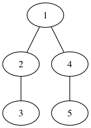

# Breadth First Search (BFS)
- We have a graph and we want to visit every node -> we can do it with BFS
- We visit every vertex exactly once
- We visit the neighbours then the neighbours of these new vertices and so on
- Running time complexity: <b>O(V+E)</b>
- Memory complexity is not good: we have to store lots of references
- That's why DFS is ususally preferred
- BUT it constructs a shortest path: Dijkstra algorithm does a BFS if all the edge weights are equal to 1

### Iteration
- We have an empty queue at the beginning and we keep checking whether we have visited the given node or not
  - Keep iterating until queue is not empty
```ruby
def bfs(vertex)
  Queue queue
  vertex set visited true
  queue.enqueue(vertex)

  while queue not empty
    actual = quque.dequeue()

    for v in actual neighbors
      if v is not visited
        v set visited true
        queue.enqueue(v)
```


> Queue:{A}

> Queue: {A}; eplore A --> Queue: {G F B}

> Queue: {G F B}; explore B --> Queue: {D C G F}

> Queue: {D C G F}; explore F --> Queue: {D C G} ; F is leaf

> Queue: {D C G}; explore G --> Queue: {H D C}

> Queue: {H D C}; explore C --> Queue: {H D}; C is leaf

> Queue: {H D}; explore D --> Queue: {E H};

> Queue: {E H}; explore H --> Queue: {E}; H is leaf

> Queue: {E}; explore E --> Queue: {}; H is leaf

> Queue: {} is empty -> <b>FINFISHED !!!</b>

> <b>Visited order: A B F G C D H E</b>

### <u>Application</u>
- In Artificial intelligence / machine learning it can prove to be very important: robots can sicover the surrounding mor easily with BFS than DFS
- It is also very important in maximum flow: Edmonds-Karp algorithm uses BFS for finding augmenting paths
- Cheyen's algorithm in garbage collection -> it help to maintain active references on the heap memory
- It uses BFS to detect all the references on the heap
- Serialization/ deserialization of a tree like structure (for example when order does matter) -> it allows the tree to be reconstructeed in an efficient manner !!!


Visited Order: 1 2 4 3 5

```java
import java.util.ArrayList;
import java.util.List;

public class Vertex {
  private int data;
  private boolean visited;
  private List<Vertex> neighbourList;

  public Vertex(int data) {
    this.data = data;
    this.neighbourList = new ArrayList<>();
  }

  public int getData() { return data; }

  public void setData(int data) { this.data = data; }

  public boolean isVisited() { return visited; }

  public void setVisited(boolean visited) { this.visited = visited; }

  public List<Vertex> getNeighbourList() { return neighbourList; }

  public void setNeighbourList(List<Vertex> neighbourList) { this.neighbourList = neighbourList; }

  public void addNeighbourList(Vertex vertex) { this.neighbourList.add(vertex); }

  @Override
  public String toString() { return "" + this.data; }
}
```

```java
import java.util.LinkedList;
import java.util.Queue;

public class BFS {

  public void bfs(Vertex root) {
    Queue<Vertex> queue = new LinkedList<>();
    root.setVisited(true);
    queue.add(root);

    while( !queue.isEmpty() ) {


      Vertex actualVertex = queue.remove();
      System.out.println(actualVertex + " ");

      for(Vertex v : actualVertex.getNeighbourList())
        if (!v.isVisited()) {
          v.setVisited(true);
          queue.add(v);
        }
    }
  }

  public static void main(String[] args) {
    BFS f = new BFS();
    Vertex vertex1 = new Vertex(1);
    Vertex vertex2 = new Vertex(2);
    Vertex vertex3 = new Vertex(3);
    Vertex vertex4 = new Vertex(4);
    Vertex vertex5 = new Vertex(5);

    vertex1.addNeighbourList(vertex2);
    vertex1.addNeighbourList(vertex4);
    vertex4.addNeighbourList(vertex5);
    vertex2.addNeighbourList(vertex3);

    f.bfs(vertex1); // visited order: 1 2 4 3 5
  }
}
```
