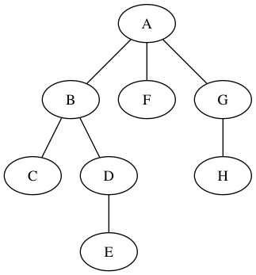
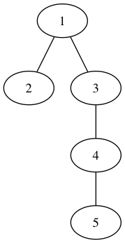
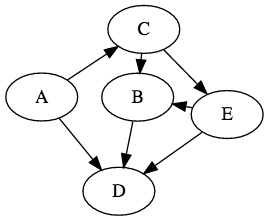
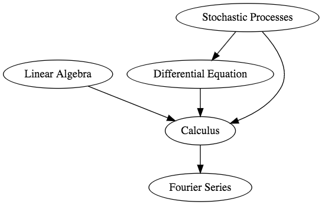
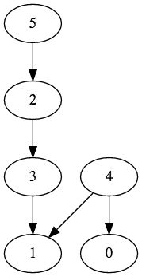

# Depth First Search (DFS)
- It was investigated as strategy for solving mazes by Tremaux in the 19th century
- It explores as far as possible along each branch before backtracking // BFS was a layer-by-layer algorithm
- Time complexity of travering a graph with <b>DFS: O(V+E)</b>
- Memory complexity: a bit better than that of <b>BFS</b> !!!
- Performance is the approximate the same for both <b>Recursion and Iteration</b>

### <b>Recursion</b>:
```ruby
def dfs(vertex)
  vertex set visited true
  print vertex

  for v in vertex neighbours
      if v is not visited
        dfs(v)
```

### <b>Iteration</b>:
```ruby
def dfs(vertex)
  Stack stack
  vertex set visited true
  stack.push(vertex)

  while stack not empty
    actual = stack.pop()

    for v in actual neighbours
      if v is not visited
        v set visited true
        stack.push(v)
```


> Stack: {A}

> Stack: {A}; explore A --> Stack: {G F B}

> Stack: {G F B}; explore B --> Stack: {G F D C}

> Stack: {G F D C}; explore C --> Stack: {G F D}; C is leaf

> Stack: {G F D}; explore D --> Stack: {G F E};

> Stack: {G F E}; explore E --> Stack: {G F}; E is leaf

> Stack: {G F}; explore F --> Stack: {G}; F is leaf

> Stack: {G}; explore G --> Stack: {H};

> Stack: {H}; explore H --> Stack: {}; H is leaf

> Stack: {} is empty -> FINFISHED !!!

> Visited order: A B C D E F G H


- <u>Applications</u>
  - Topological ordering
  - Kosaraju algorithm for finding strongly connected components in a graph which can be proved to be very important in recommemndation systems (youtube)
  - Detecting cycles (checking whether a graph is a <b>Directed Acyclic Graph (DAG)</b> or not)
  - Generating amzes OR finding way out of a maze



- Visited Order: 1 3 4 5 2 (Right then left)
- Visited Order: 1 2 3 4 5 (Left then right)

```java
import java.util.ArrayList;
import java.util.List;
import java.util.Stack;

public class DFS {

  private Stack<Vertex> stack;

  public DFS() {
    this.stack = new Stack<>();
  }

  public void dfs(List<Vertex> vertexList) {
    // For loop here means if you have 2 or more un-connected graph
    // We still want to visit every single vertex
    for(Vertex v : vertexList) {
      if(!v.isVisited()) {
        v.setVisited(true);
        // dfsWithStack(v);
        dfsRecursive(v);
      }
    }
  }

  private void dfsRecursive(Vertex v) {
    System.out.print(v + " ");

    for(Vertex vertex : v.getNeighbourList()) {
      if(!vertex.isVisited()) {
        vertex.setVisited(true);
        dfsRecursive(vertex);
      }
    }
  }

  // sure that we will visit every vertex in a single connected graph
  private void dfsWithStack(Vertex rootVertex) {
    this.stack.add(rootVertex);
    rootVertex.setVisited(true);

    while(!stack.isEmpty()) {
      Vertex actualVertex = stack.pop();
      System.out.println(actualVertex + " ");

      for(Vertex v : actualVertex.getNeighbourList()) {
        if (!v.isVisited()) {
          v.setVisited(true);
          this.stack.push(v);
        }
      }
    }
  }

  public static void main(String[] args) {

    Vertex v1 = new Vertex("1");
    Vertex v2 = new Vertex("2");
    Vertex v3 = new Vertex("3");
    Vertex v4 = new Vertex("4");
    Vertex v5 = new Vertex("5");

    List<Vertex> list = new ArrayList<>();

    v1.addNeighbourList(v2);
    v1.addNeighbourList(v3);
    v3.addNeighbourList(v4);
    v4.addNeighbourList(v5);

    list.add(v1);
    list.add(v2);
    list.add(v3);
    list.add(v4);
    list.add(v5);

    DFS f = new DFS();
    f.dfs(list);
    // With stack; visited order: 1 3 4 5 2 visit right and then left
    // With Recursion; visited order: 1 2 3 4 5 visit left and then right
  }
}
```

## Topological Ordering/ Sort
- Topological <b>ordering of a directed graph</b> is a linear ordering of its vertices such that for every directed edge <b>uv</b> from vertex <b>u</b> to vertex <b>v, u</b> comes before <b>v</b> in the ordering.
- For instance, the vertices of the graph may represent tasks to be performed, and the edges amy represent constraints that one task must be performed before another
- In this application, a topological ordering is just a valid sequence for the tasks
- We can use topological ordering only if the graph has no directed cycles <b>(DAG)<b>
- Any <b>DGA</b> has at least one topological order


- Linear time complexity
- It is very important in project management
- Another important fact has something to do with Hamiltonian cycles
- <b>Hamiltonian path:<b> it is a path in an undirected or directed graph that visits each vertex exactly once.
- If a Hamiltonian path exists, the topological sort order is unique, no other orderresprects the edges of the path. Conversely, if a topological sort does not form a Hailtonian path, the DAGwill hae two or more valid topological orderings
- Finding Hamiltonian path is NP complete problem: but we can decide whether such a path exist in linear time


> We have to find a vertex with no incoming edges!!!

> - Topological order: A - C - E - B - D

#### <u>Applications:</u>
- Dependency management in software engineering (Maven, Ant or Gradle)
- At universities -> constructing the syllabus / curriculum
> Ex: 
> - Calculus requirement: has to take Fourier Series.
> - Can't complete Linear Algebra, because we have to complete Calculus first
> - <b>The order in which you have to complete the courses:
>    - Fourier series -> Caculus -> Linear Algebra -> Differential Equations -> Stochastic Processes

#### Topological implementation using DFS


```java
import java.util.ArrayList;
import java.util.Stack;
import java.util.List;

public class TopologicalOrdering {
  private Stack<Vertex> stack;

  public TopologicalOrdering() {
    this.stack = new Stack<>();
  }

  public void dfs(Vertex vertex) {
    vertex.setVisited(true);

    for(Vertex v : vertex.getNeighbourList()) {
      if(!v.isVisited()) {
        dfs(v);
      }
    }

    stack.push(vertex);
  }

  public Stack<Vertex> getStack() {
    return this.stack;
  }

  public static void main(String[] args) {
    TopologicalOrdering f = new TopologicalOrdering();
    List<Vertex> graph = new ArrayList<>();

    graph.add(new Vertex("0"));
    graph.add(new Vertex("1"));
    graph.add(new Vertex("2"));
    graph.add(new Vertex("3"));
    graph.add(new Vertex("4"));
    graph.add(new Vertex("5"));


    graph.get(2).addNeighbourList(graph.get(3));

    graph.get(3).addNeighbourList(graph.get(1));

    graph.get(4).addNeighbourList(graph.get(0));
    graph.get(4).addNeighbourList(graph.get(1));

    graph.get(5).addNeighbourList(graph.get(0));
    graph.get(5).addNeighbourList(graph.get(2));

    // for(int i = 5; i >= 0; i--) {
    for(int i = 0; i < graph.size(); i++) {
      if(!graph.get(i).isVisited())
        f.dfs(graph.get(i));
    }

    Stack<Vertex> stack = f.getStack();
    for(int i = 0; i < graph.size(); i++) {
      Vertex v = stack.pop();
      System.out.print(v + " -> ");
    }
    System.out.println();
  }
}

/*
Callindg order: node 0 first (as root) ... node 5
stack: {}
dfs(0) -> stack: { 0 } ; 0 is a leaf
dfs(1) -> stack: { 0, 1 }
dfs(2) -> def(3) -> visited 1 -> stack: { 0, 1, 3, 2 }
def(4) -> visited 0 -> stack: { 0, 1, 3, 2, 4 }
def(5) -> visited [0 and 5] -> stack: { 0, 1, 3, 2, 4, 5 }
Topological Order: 5 -> 4 -> 2 -> 3 -> 1 -> 0

----------------------------------------------------------

Calling order: node 5 first (as root) ... node 0
Stack: {}
dfs(5) -> dfs(0) -> stack: { 0 } ; 0 is a leaf
       -> dfs(2) -> dfs(3) -> dfs(1) -> stack: { 0, 1, 3, 2 }; 1 is a leaf
dfs(4) -> visited [0 and 1] -->  stack: { 0, 1, 3, 2, 5, 4 }
==> Topological Order: 4 -> 5 -> 2 -> 3 -> 1 -> 0
*/
```
