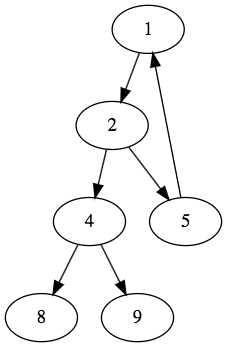
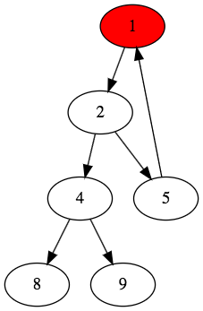
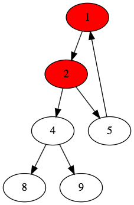
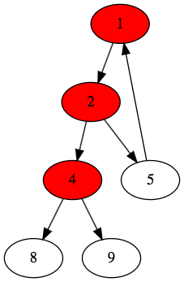
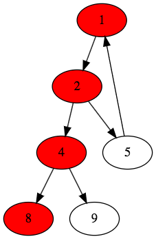
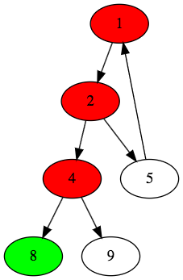
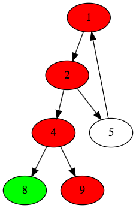
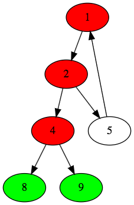
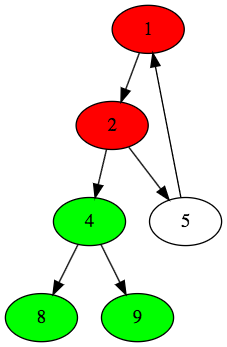
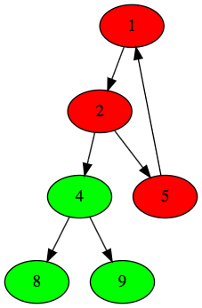

# Depth First Search (DFS)
- It was investigated as strategy for solving mazes by Tremaux in the 19th century
- It explores as far as possible along each branch before backtracking // BFS was a layer-by-layer algorithm
- Time complexity of travering a graph with <b>DFS: O(V+E)</b>
- Memory complexity: a bit better than that of <b>BFS</b> !!!
- Performance is the approximate the same for both <b>Recursion and Iteration</b>

### <b>Recursion</b>:
```ruby
def dfs(vertex)
  vertex set visited true
  print vertex

  for v in vertex neighbours
      if v is not visited
        dfs(v)
```

### <b>Iteration</b>:
```ruby
def dfs(vertex)
  Stack stack
  vertex set visited true
  stack.push(vertex)

  while stack not empty
    actual = stack.pop()

    for v in actual neighbours
      if v is not visited
        v set visited true
        stack.push(v)
```


> Stack: {A}

> Stack: {A}; explore A --> Stack: {G F B}

> Stack: {G F B}; explore B --> Stack: {G F D C}

> Stack: {G F D C}; explore C --> Stack: {G F D}; C is leaf

> Stack: {G F D}; explore D --> Stack: {G F E};

> Stack: {G F E}; explore E --> Stack: {G F}; E is leaf

> Stack: {G F}; explore F --> Stack: {G}; F is leaf

> Stack: {G}; explore G --> Stack: {H};

> Stack: {H}; explore H --> Stack: {}; H is leaf

> Stack: {} is empty -> FINFISHED !!!

> Visited order: A B C D E F G H


- <u>Applications</u>
  - Topological ordering
  - Kosaraju algorithm for finding strongly connected components in a graph which can be proved to be very important in recommemndation systems (youtube)
  - Detecting cycles (checking whether a graph is a <b>Directed Acyclic Graph (DAG)</b> or not)
  - Generating amzes OR finding way out of a maze


- Visited Order: 1 3 4 5 2 (Right then left)
- Visited Order: 1 2 3 4 5 (Left then right)

```java
import java.util.ArrayList;
import java.util.List;
import java.util.Stack;

public class DFS {

  private Stack<Vertex> stack;

  public DFS() {
    this.stack = new Stack<>();
  }

  public void dfs(List<Vertex> vertexList) {
    // For loop here means if you have 2 or more un-connected graph
    // We still want to visit every single vertex
    for(Vertex v : vertexList) {
      if(!v.isVisited()) {
        v.setVisited(true);
        // dfsWithStack(v);
        dfsRecursive(v);
      }
    }
  }

  private void dfsRecursive(Vertex v) {
    System.out.print(v + " ");

    for(Vertex vertex : v.getNeighbourList()) {
      if(!vertex.isVisited()) {
        vertex.setVisited(true);
        dfsRecursive(vertex);
      }
    }
  }

  // sure that we will visit every vertex in a single connected graph
  private void dfsWithStack(Vertex rootVertex) {
    this.stack.add(rootVertex);
    rootVertex.setVisited(true);

    while(!stack.isEmpty()) {
      Vertex actualVertex = stack.pop();
      System.out.println(actualVertex + " ");

      for(Vertex v : actualVertex.getNeighbourList()) {
        if (!v.isVisited()) {
          v.setVisited(true);
          this.stack.push(v);
        }
      }
    }
  }

  public static void main(String[] args) {

    Vertex v1 = new Vertex("1");
    Vertex v2 = new Vertex("2");
    Vertex v3 = new Vertex("3");
    Vertex v4 = new Vertex("4");
    Vertex v5 = new Vertex("5");

    List<Vertex> list = new ArrayList<>();

    v1.addNeighbourList(v2);
    v1.addNeighbourList(v3);
    v3.addNeighbourList(v4);
    v4.addNeighbourList(v5);

    list.add(v1);
    list.add(v2);
    list.add(v3);
    list.add(v4);
    list.add(v5);

    DFS f = new DFS();
    f.dfs(list);
    // With stack; visited order: 1 3 4 5 2 visit right and then left
    // With Recursion; visited order: 1 2 3 4 5 visit left and then right
  }
}
```

## Topological Ordering/ Sort
- Topological <b>ordering of a directed graph</b> is a linear ordering of its vertices such that for every directed edge <b>uv</b> from vertex <b>u</b> to vertex <b>v, u</b> comes before <b>v</b> in the ordering.
- For instance, the vertices of the graph may represent tasks to be performed, and the edges amy represent constraints that one task must be performed before another
- In this application, a topological ordering is just a valid sequence for the tasks
- We can use topological ordering only if the graph has no directed cycles <b>(DAG)</b>
- Any <b>DGA</b> has at least one topological order


- Linear time complexity
- It is very important in project management
- Another important fact has something to do with Hamiltonian cycles
- <b>Hamiltonian path:</b> it is a path in an undirected or directed graph that visits each vertex exactly once.
- If a Hamiltonian path exists, the topological sort order is unique, no other orderresprects the edges of the path. Conversely, if a topological sort does not form a Hailtonian path, the DAGwill hae two or more valid topological orderings
- Finding Hamiltonian path is NP complete problem: but we can decide whether such a path exist in linear time


> We have to find a vertex with no incoming edges!!!

> - Topological order: A - C - E - B - D

#### <u>Applications:</u>
- Dependency management in software engineering (Maven, Ant or Gradle)
- At universities -> constructing the syllabus / curriculum
> Ex: 
> - Calculus requirement: has to take Fourier Series.
> - Can't complete Linear Algebra, because we have to complete Calculus first
> - <b>The order in which you have to complete the courses:
>    - Fourier series -> Caculus -> Linear Algebra -> Differential Equations -> Stochastic Processes</b>

#### Topological implementation using DFS


```java
import java.util.ArrayList;
import java.util.Stack;
import java.util.List;

public class TopologicalOrdering {
  private Stack<Vertex> stack;

  public TopologicalOrdering() {
    this.stack = new Stack<>();
  }

  public void dfs(Vertex vertex) {
    vertex.setVisited(true);

    for(Vertex v : vertex.getNeighbourList()) {
      if(!v.isVisited()) {
        dfs(v);
      }
    }

    stack.push(vertex);
  }

  public Stack<Vertex> getStack() {
    return this.stack;
  }

  public static void main(String[] args) {
    TopologicalOrdering f = new TopologicalOrdering();
    List<Vertex> graph = new ArrayList<>();

    graph.add(new Vertex("0"));
    graph.add(new Vertex("1"));
    graph.add(new Vertex("2"));
    graph.add(new Vertex("3"));
    graph.add(new Vertex("4"));
    graph.add(new Vertex("5"));


    graph.get(2).addNeighbourList(graph.get(3));

    graph.get(3).addNeighbourList(graph.get(1));

    graph.get(4).addNeighbourList(graph.get(0));
    graph.get(4).addNeighbourList(graph.get(1));

    graph.get(5).addNeighbourList(graph.get(0));
    graph.get(5).addNeighbourList(graph.get(2));

    // for(int i = 5; i >= 0; i--) {
    for(int i = 0; i < graph.size(); i++) {
      if(!graph.get(i).isVisited())
        f.dfs(graph.get(i));
    }

    Stack<Vertex> stack = f.getStack();
    for(int i = 0; i < graph.size(); i++) {
      Vertex v = stack.pop();
      System.out.print(v + " -> ");
    }
    System.out.println();
  }
}

/*
Callindg order: node 0 first (as root) ... node 5
stack: {}
dfs(0) -> stack: { 0 } ; 0 is a leaf
dfs(1) -> stack: { 0, 1 }
dfs(2) -> def(3) -> visited 1 -> stack: { 0, 1, 3, 2 }
def(4) -> visited 0 -> stack: { 0, 1, 3, 2, 4 }
def(5) -> visited [0 and 5] -> stack: { 0, 1, 3, 2, 4, 5 }
Topological Order: 5 -> 4 -> 2 -> 3 -> 1 -> 0

----------------------------------------------------------

Calling order: node 5 first (as root) ... node 0
Stack: {}
dfs(5) -> dfs(0) -> stack: { 0 } ; 0 is a leaf
       -> dfs(2) -> dfs(3) -> dfs(1) -> stack: { 0, 1, 3, 2 }; 1 is a leaf
dfs(4) -> visited [0 and 1] -->  stack: { 0, 1, 3, 2, 5, 4 }
==> Topological Order: 4 -> 5 -> 2 -> 3 -> 1 -> 0
*/
```


## Cycle Detection
- Cycle detection is quite intuitive
- We would like to detect cycles in a directed graph
- Sometimes: cycles are good -> we are looking for arbitrage situations on the FOREX than cycles are exactly what we are looking for!!!
- BUT most of the times: we want to avoid them !!!
- Operating systems can have several processes -> there may be same cases when there is a cycle -> they are waiting for each other
- <b>OPERATING SYSTEM FREEZE !!!</b>
- So we have to vaoid cycles

```ruby
def(Vertex vertex)
  vertex.setVisited(false);
  vertex.setBeingVisited(true);

  for(Vertex v : vertex.getAdjacenciesList()) {

    if(v.isBeingVisited()) {
      print "Backward edge ... so there is a cycle in the graph!"
      return;
    }

    if(!v.isVisited()) {
      v.setVisited(true);
      DFS(v);
    }
  }
  vertex.setVisited(true);
  vertex.setBeingVisited(false);
```

- <b><u> What dows it mean "beingVisited"?</u></b>
- If we backtrack and come to the situation that the vertex from where we started has <b>No</b> more unvisited adacent vertices -> It will become visited
- Until then -> it is being visited

- There is a Cycle!!! Why? Because we visit again a vertex that's being visited

> Example:
- Let's consider a graph like this:
> 


>  Being visited: 1

>  Being visited: 1, 2


>  Being visited: 1, 2, 4

>  Being visited: 1, 2, 4, 8


> 
> - Being visited: 1, 2 4, 8; 8 is a leaf so 8 now is mark visited, and remove from being visited --> being visited list : 1, 2, 4


> 
> - Being visted: 1, 2, 4; BackTrack to 4, and 4 is still being visted, and has child 9 --> now 9 is being visted --> Being visited list : 1, 2, 4, 9

> 
> - Being visited: 1, 2, 4, 9; 9 is a leaf so 9 now is mark visited, and remove from being visited --> being visited list : 1, 2, 4

> 
> - Being visited: 1, 2, 4; backtrack to 4 and all children of 4 is visited, --> 4 now marked as visited and remove from being visited --> Being visited list: 1, 2

> 
> - Being visited list: 1, 2; Backtrack to 2, and two has 5 is child --> visited 5 and marked as being visited --> being visited list: 1, 2, 5.
> - Then 5 visited 1, and 1 is being visited. Therefore, thre is a cycle!!!

<b>===> THERE IS A CYCLE!!!</b> Why? Because we visit again a vertex that's being visited

```java
import java.util.ArrayList;
import java.util.List;

public class CycleDetectionDFS {

  // in case if there is more than 1 un-connected graphs
  public void detectCycle(List<VertexCycle> vertexList) {
    for(VertexCycle v : vertexList)
      if(!v.isVisited())
        dfs(v);
  }

  // if there is an connected graph, we just start at a root vertex
  private void dfs(VertexCycle vertex) {

    System.out.println("DFS on vetex " + vertex);
    vertex.setBeingVisited(true);

    // iterate all the neighbours(v's) of this vertex
    for(VertexCycle v : vertex.getNeighbourList() ) {

      System.out.println("Visiting the neighbours of vertex " + vertex);

      // if this vertex (being visited) is visiting a vertex v that is being visited --> Cycle
      if(v.isBeingVisited()) {
        System.out.println("There is a backward edge --> There is Cycle !!!");
        return ;
      }
      if(!v.isVisited()){
        System.out.println("Visiting vertex " + v + " recursively...");
        v.setVisited(true);
        dfs(v);
      }
    }

    System.out.println("Set vertex " + vertex + " setBeingVisited(false) and visited(true) ... \n");
    // reach the end (leaf) --> no longer in visiting process
    vertex.setBeingVisited(false);
    vertex.setVisited(true);
  }

  public static void main(String[] args) {
    VertexCycle v1 = new VertexCycle("1");
    VertexCycle v2 = new VertexCycle("2");
    VertexCycle v4 = new VertexCycle("4");
    VertexCycle v5 = new VertexCycle("5");
    VertexCycle v8 = new VertexCycle("8");
    VertexCycle v9 = new VertexCycle("9");

    //Cycle
    v1.addNeighbour(v2); v5.addNeighbour(v1);
    v2.addNeighbour(v4); v2.addNeighbour(v5);

    v4.addNeighbour(v8); v4.addNeighbour(v9);

    List<VertexCycle> vertices = new ArrayList<>();
    vertices.add(v1);
    vertices.add(v2);
    vertices.add(v4);
    vertices.add(v5);
    vertices.add(v8);
    vertices.add(v9);

    CycleDetectionDFS f = new CycleDetectionDFS();
    f.detectCycle(vertices);
  }
}
/*
DFS on vetex 1
Visiting the neighbours of vertex 1
Visiting vertex 2 recursively...
DFS on vetex 2
Visiting the neighbours of vertex 2
Visiting vertex 4 recursively...
DFS on vetex 4
Visiting the neighbours of vertex 4
Visiting vertex 8 recursively...
DFS on vetex 8
Set vertex 8 setBeingVisited(false) and visited(true) ...

Visiting the neighbours of vertex 4
Visiting vertex 9 recursively...
DFS on vetex 9
Set vertex 9 setBeingVisited(false) and visited(true) ...

Set vertex 4 setBeingVisited(false) and visited(true) ...

Visiting the neighbours of vertex 2
Visiting vertex 5 recursively...
DFS on vetex 5
Visiting the neighbours of vertex 5
There is a backward edge --> There is Cycle !!!
Set vertex 2 setBeingVisited(false) and visited(true) ...

Set vertex 1 setBeingVisited(false) and visited(true) ...
*/
```

## Maze Solving Algorithm

```java
/*
Map:
1: wall, 2: start point, 3: exit (goal)
  1 1 1 1 3
  1 2 0 1 0
  1 1 0 1 0
  0 0 0 0 0
  0 1 1 1 0
*/

public class MazeSolver {

  private int[][] mazeMap;
  private int[][] solutionTable;
  private boolean[][] visited;
  private int startPositionCol;
  private int startPositionRow;
  private int goalRow;
  private int goalCol;

  public MazeSolver(int[][] mazeMap, int startPositionRow, int startPositionCol) {
    this.mazeMap = mazeMap;
    this.visited = new boolean[mazeMap.length][mazeMap.length];
    this.solutionTable = new int[mazeMap.length][mazeMap.length];
    this.startPositionRow = startPositionRow;
    this.startPositionCol = startPositionCol;
  }

  public void findWayOut() {

    System.out.println("Starting at " + startPositionRow + ", " + startPositionCol);

    if(dfs(startPositionRow, startPositionCol)) {
      System.out.println("Route found to exit !!! ");
      printSolution();
    } else {
      System.out.println("No solution found ...");
    }
  }

  private boolean dfs(int rowIndex, int colIndex) {

    System.out.println("Visiting i = " + rowIndex + ", j = " + colIndex);
    // Finsished
    if( this.mazeMap[rowIndex][colIndex] == 3) {
      System.out.println("Solution i = " + rowIndex + ", j = " + colIndex);
      this.goalRow = rowIndex;
      this.goalCol = colIndex;
      return true; // Found way out !!!
    }

    //
    this.visited[rowIndex][colIndex] = true;

    if(isValidMove(rowIndex + 1, colIndex))
      if (dfs(rowIndex + 1, colIndex)) { // go down
        solutionTable[rowIndex + 1][colIndex] = 1;
        return true;
      }

    if(isValidMove(rowIndex, colIndex + 1))
      if (dfs(rowIndex, colIndex + 1)) { // go right
        solutionTable[rowIndex][colIndex + 1] = 1;
        return true;
      }

    if(isValidMove(rowIndex, colIndex - 1))
      if (dfs(rowIndex, colIndex - 1)) { // go left
        solutionTable[rowIndex][colIndex - 1] = 1;
        return true;
      }

    if(isValidMove(rowIndex - 1, colIndex)) {
      if (dfs(rowIndex - 1, colIndex)) // go up
        solutionTable[rowIndex - 1][colIndex] = 1;
        return true;
      }

    return false;
  }

  // checking: x, y boundary, wall ( != 1), already visited
  private boolean isValidMove(int x, int y) {
    int endOfMap = this.mazeMap.length - 1;

    boolean xValid = (x >= 0 && x <= endOfMap);
    boolean yValid = (y >= 0 && y <= endOfMap);

    return xValid && yValid && this.mazeMap[x][y] != 1 && !visited[x][y];
  }

  private void printSolution() {
    // starting position
    solutionTable[startPositionRow][startPositionCol] = 2;
    solutionTable[goalRow][goalCol] = 3;

    for(int i = 0; i < this.solutionTable.length; i++) {
      for(int j = 0; j < this.solutionTable.length; j++) {
        if(solutionTable[i][j] == 1) { System.out.print(" P "); }
        else if(solutionTable[i][j] == 2) { System.out.print(" S "); }
        else if(solutionTable[i][j] == 3) { System.out.print(" G "); }
        else { System.out.print(" - ");}
      }
      System.out.println();
    }
  }

  public static void main(String[] args) {
    FileReader file = new FileReader("map.txt", 5, 5);
    file.parseFile();

    int startRow = file.getStartPositionRow();
    int startCol = file.getStartPositionCol();

    MazeSolver mazeSolver = new MazeSolver(file.getMap(), startRow, startCol);
    mazeSolver.findWayOut();
  }
}
/*
Map:
1: wall, 2: start point, 3: exit (goal)
  1 1 1 1 3
  1 2 0 1 0
  1 1 0 1 0
  0 0 0 0 0
  0 1 1 1 0

Starting at 1, 1
Visiting i = 1, j = 1
Visiting i = 1, j = 2
Visiting i = 2, j = 2
Visiting i = 3, j = 2
Visiting i = 3, j = 3
Visiting i = 3, j = 4
Visiting i = 4, j = 4
Visiting i = 2, j = 4
Visiting i = 1, j = 4
Visiting i = 0, j = 4
Solution i = 0, j = 4
Route found to exit !!!
Solution path:
 -  -  -  -  G
 -  S  P  -  P
 -  -  P  -  P
 -  -  P  P  P
 -  -  -  -  -
*/
```
