# Shortest Path Algorithms
- Shorest path problem: finding a path between two vertices in a graph such that the sum of the weights of its edges is minimized.
- Dijkstra algorithm
- Bellman-Ford algorithm
- A* search
- Floyd-Warshall alogrithm

## Dijkstra Algorithm
- It was constructed by computer scientist <b>Edsger Dijstra in 1956</b>
- <b>Dijstra can handle positive edge weights !!! // Bellman-Ford algorithm can have negative weights as well</b>
- Several variants: it can find the shortest path from A to B, but it is able to construct a shortest path tree as well -> defines the shortest paths from a source to all the other nodes.
- This is asymptotically the fastest known single-source shortest-path algorithm for arbitrary directed graphs with unbounded non-negative weights

### <u>Dijstra algorithm</u>
- Dijkstra's algorithm time complexity: <b>O(V*logV + E)</b>
- Dijkstra's algorithm is a greedy one: it tries to find the global optimum with the help of local minimum -> it turns out to be good !!!
- It is greedy -> on every iteration we want to find the minimum distance to the next vertex possible -> appropriate data structures: <b>heaps (binary or Fibonacci)</b> or in general a <b>priority queue</b>

### Psedudocode
```ruby
class Node
  name
  min_distance
  Node predicessor

def DijkstraAlgorithm(Graph, source)
  distance[source] = 0
  create certex queue Q
      # Initialization phase: distance form source is 0, because that is the starting point. All the other nodes distances are infinity because we do not know the distances in advance
  for v in Graph
    distance[v] = inf
    predecessor[v] = undefined # precious node in the shortest path
    add v to Q
  while Q not empty
    u = vertex in Q with min distance # this is why to use heaps !!!
    remove v from Q

    for each neighbor v of u
      tempDist = distance[u] + distBetween(u,v)
      if tempDist < distance[v]
        distance[v] = tempDist
        predecessor[v] = u

  return distance[] # contains the shortest distances from source to other nodes
```


## Dijsktra Algorithm in un-directed graph (adjacency matrix)
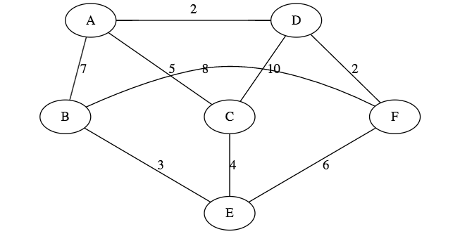

| v  | A | B | C | D | E | F |
|---|---|---|---|---|---|---|
|   |   |   |   |   |   |   |

------
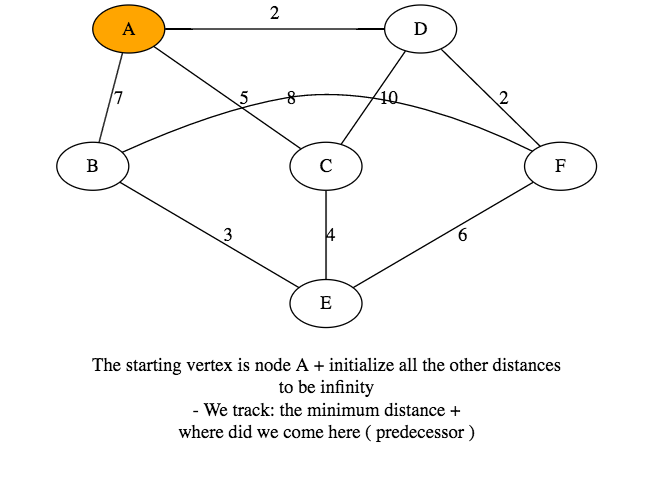

| v | A | B   | C   | D   | E   | F   |
|---|---|-----|-----|-----|-----|-----|
| A | <b>[0]</b> | inf | inf | inf | inf | inf |

------

| v | A | B   | C   | D   | E   | F   |
|---|---|-----|-----|-----|-----|-----|
| A | <b>[0]</b> | inf | inf | inf | inf | inf |
| A |   | 7   | 5   | <b>[2]</b>    | inf | inf |


------

| v | A | B   | C   | D   | E   | F   |
|---|---|-----|-----|-----|-----|-----|
| A | <b>[0]</b>  | inf | inf | inf | inf | inf |
| A |   | 7   | 5   | <b>[2]</b>    | inf | inf |
| D |   | 7   | 5   |   | inf | <b>[4]</b>  |


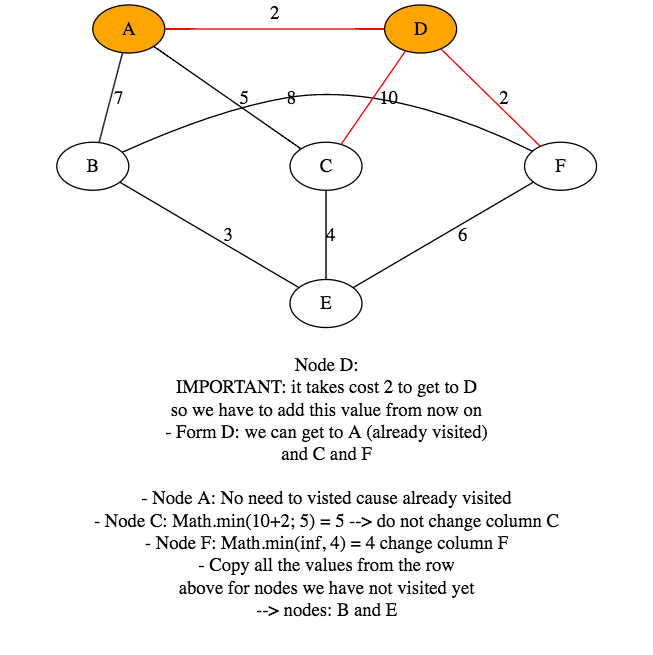


------

| v | A | B   | C   | D   | E   | F   |
|---|---|-----|-----|-----|-----|-----|
| A | <b>[0]</b>  | inf | inf | inf | inf | inf |
| A |   | 7   | 5   | <b>[2]</b>    | inf | inf |
| D |   | 7   | 5   |   | inf | <b>[4]</b>  |
| F |   | 7   | <b>[5]</b>   |   | 10  | |


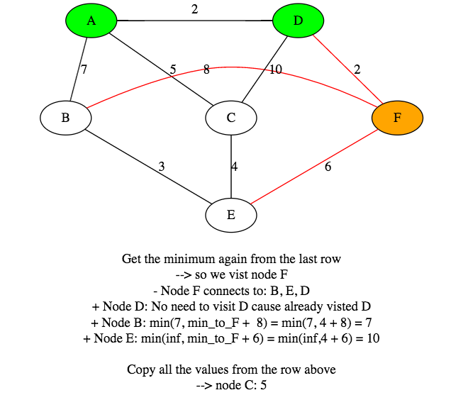


------


| v | A | B   | C   | D   | E   | F   |
|---|---|-----|-----|-----|-----|-----|
| A | <b>[0]</b>  | inf | inf | inf | inf | inf |
| A |   | 7   | 5   | <b>[2]</b>    | inf | inf |
| D |   | 7   | 5   |   | inf | <b>[4]</b>  |
| F |   | 7   | <b>[5]</b>   |   | 10  | |
| C |   | <b>[7]</b>   |    |   | 9 | |


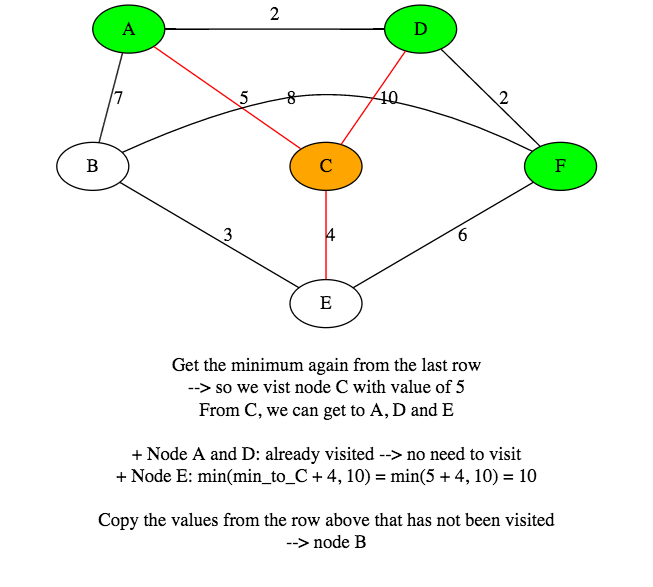


------

| v | A | B   | C   | D   | E   | F   |
|---|---|-----|-----|-----|-----|-----|
| A | <b>[0]</b>  | inf | inf | inf | inf | inf |
| A |   | 7   | 5   | <b>[2]</b>    | inf | inf |
| D |   | 7   | 5   |   | inf | <b>[4]</b>  |
| F |   | 7   | <b>[5]</b>   |   | 10  | |
| C |   | <b>[7]</b>   |    |   | 9 | |
| B |   |   |    |   | <b>[9]</b>  | |


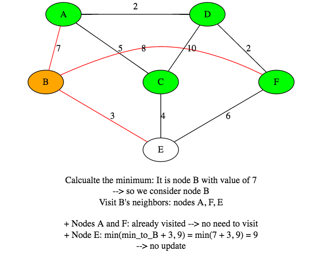


------

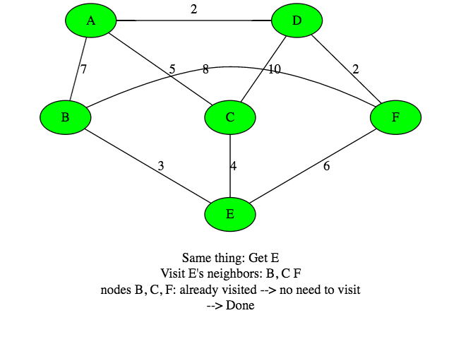

| v | A | B   | C   | D   | E   | F   |
|---|---|-----|-----|-----|-----|-----|
| A | <b>[0]</b>  | inf | inf | inf | inf | inf |
| A |   | 7   | 5   | <b>[2]</b>    | inf | inf |
| D |   | 7   | 5   |   | inf | <b>[4]</b>  |
| F |   | 7   | <b>[5]</b>   |   | 10  | |
| C |   | <b>[7]</b>   |    |   | 9 | |
| B |   |   |    |   | <b>[9]</b>  | |

- Conclusion: <b>[#] values</b> represent what are the shortest path vlaues from <b>A</b> to the <b>given node</b>
- If we want the path itself: we have to <b>"Back Track"</b>, have to store predecessors


```java
public class Edge {
  private double weight;
  private Vertex startVertex;
  private Vertex targetVertex;

  public Edge(double weight, Vertex startVertex, Vertex targetVertex) {
    this.weight = weight;
    this.startVertex = startVertex;
    this.targetVertex = targetVertex;
  }

  public double getWeight() { return weight; }
  public void setWeight(double weight) { this.weight = weight; }

  public Vertex getStartVertex() { return startVertex; }
  public void setStartVertex(Vertex startVertex) { this.startVertex = startVertex; }

  public Vertex getTargetVertex() { return targetVertex; }
  public void setTargetVertex(Vertex targetVertex) { this.targetVertex = targetVertex; }
}
```

```java
import java.util.ArrayList;
import java.util.List;

public class Vertex implements Comparable<Vertex> { // we want to compare 2 vertex by their distances

  private String name;
  private List<Edge> adjaceciesList;

  private boolean visited;
  private Vertex predecessor;
  private double distance = Double.MAX_VALUE;

  public Vertex(String name) {
    this.name = name;
    this.adjaceciesList = new ArrayList<>();
  }

  public void addNeighour(Edge edge) {
    this.adjaceciesList.add(edge);
  }

  public String getName() { return name; }
  public void setName(String name) { this.name = name; }

  public List<Edge> getAdjaceciesList() { return adjaceciesList; }
  public void setAdjaceciesList(List<Edge> adjaceciesList) { this.adjaceciesList = adjaceciesList; }


  public boolean isVisited() { return visited; }
  public void setVisited(boolean visited) { this.visited = visited; }


  public Vertex getPredecessor() { return predecessor; }
  public void setPredecessor(Vertex predecessor) { this.predecessor = predecessor; }


  public double getDistance() { return distance; }
  public void setDistance(double distance) { this.distance = distance; }


  @Override
  public String toString(){ return this.name; }

  @Override
  public int compareTo(Vertex otherVertex) {
    return Double.compare(this.distance, otherVertex.getDistance());
    // 0: same, -1: this.distance < otherVertex's distance, 1: this.distance > otherVertex's distance,
  }
}
```

```java
import java.util.PriorityQueue;
import java.util.ArrayList;
import java.util.List;
import java.util.Collections;

// Dijkstra method: )(E + V*logV)
public class Dijkstra {

  public void computePaths(Vertex sourceVertex) {
    sourceVertex.setDistance(0); // shortest distance from source to source(itself) is 0
    PriorityQueue<Vertex> priorityQueue = new PriorityQueue<>();
    priorityQueue.add(sourceVertex);

    while(!priorityQueue.isEmpty()) {
      Vertex actualVetex = priorityQueue.poll();

      for(Edge edge : actualVetex.getAdjaceciesList()) {
        Vertex v = edge.getTargetVertex();

        double newDistance = actualVetex.getDistance() + edge.getWeight();

        if(newDistance < v.getDistance()){
          priorityQueue.remove(v);
          v.setDistance(newDistance);
          v.setPredecessor(actualVetex);
          priorityQueue.add(v);
        }
      }
    }
  }

  // get the shortest path from source vertex to targetVertex
  public List<Vertex> getShortestPathTo(Vertex targetVertex) {
    List<Vertex> shortestpathToTarget = new ArrayList<>();
    //BACKTRACK
    for(Vertex vertex = targetVertex; vertex != null; vertex = vertex.getPredecessor()) {
      shortestpathToTarget.add(vertex);
    }
    Collections.reverse(shortestpathToTarget); // reverse the list to get the right path order
    return shortestpathToTarget;
  }

  public static void main(String[] args) {
    Vertex v0 = new Vertex("A");
    Vertex v1 = new Vertex("B");
    Vertex v2 = new Vertex("C");

    v0.addNeighour(new Edge(1,v0,v1));
    v0.addNeighour(new Edge(3,v0,v2));
    v1.addNeighour(new Edge(1,v1,v2));

    Dijkstra algorithm = new Dijkstra();
    algorithm.computePaths(v0);

    System.out.println(algorithm.getShortestPathTo(v2));
  }
}
```
#### <u>Out put:</u>

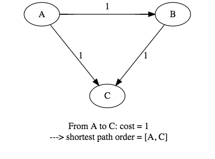


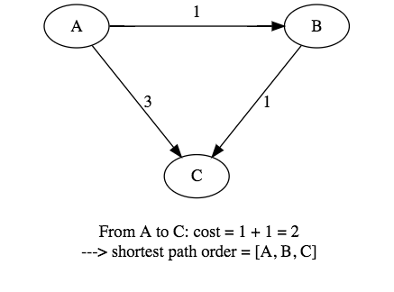


## Bellman-Ford algorithm
- Invented in 1958 by Bellman and Ford independently
- slower than Dijstra's but more robust: it can handle negative edge
- Dijkstra algorithm choose the edge greedely, with the lowest cost:
  - Bellman-Ford relaxes all edges at the same time for <b>V-1</b> iteration
- Running time is <b>O(V*E)</b>
- Does <b>(V-1)</b> iterations <b>(+1)</b> to detect cycles: if cost decreases in the <b>V-th</b> iteration, than there is negative cycle, because all the paths are traversen up to the <b>(V-1)</b> iteration !!!

### What is the problem?
- <u>Negative cycle:</u>

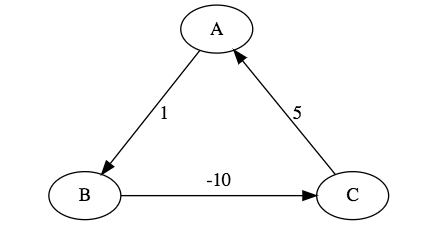

- What is the problem?
  - If we would like to find a path with the minimum cost we have
  - to go A -> B -> C -> A <b>to decrease the overall cost</b>
  - <b>And a next cycle: decrease the cost again</b>
  - <b>And again ...</b>
- Real life scenarios: no negative cycles at all ...
- but sometimes we transform a problem into a graph with positive/ negative edges weight
- And looking for some negative cycles !!!


### <u>Bellman-Ford:</u> pseudocode
```ruby
def BellmanFordAlgorithm(vertices, edges, source)
  distance[source] = 0

  for v in Graph
    distance[v] = inf
    predicessor[v] = undefined # precious node in the shortest path

=begin
For all edges, if the distance to the destination can be shortened
by taking the edge, the distance is updated to the new lower value
V-1 times -> we make relaxation
=end
  for i = 1 ... num_vertices - 1
    for each edge(u,v) with weight w in edges

      tempDist = distance[u] + w

      if tempDist < distance[v]
        distance[u] = tempDist
        predecessor[v] = u

=begin
Since the longest possible path without a cycle can have (V-1) edges,
the edges must be scanned (V-1) times to ensure the shortest path
has been found for all nodes
*** A Final scan of all the edges is performed and if any distance
is updated -> means there is a negative cycle !!!
=end

  for each edge(u,v) with weight w in edges
    if distance[u] + w < distance[v]
      error: " Negative cycle detected"
```

#### <b>1970: <u>Yen optimization</u></b>
- Yen algorithm: It is the Bellman-Ford algorithm with some optimization.
- We can terminate the algorithm if there is no change in the distances between two iterations !!!
- (We use the same technique in bubble sort)

- <b><u>Application:</u></b>
  - cycle detection can prove to be very important
  - Negative cycles as well -> we have to run the Bellman-Ford algorithm that can handle negative edge weights by default
  - On the FOREX market it can detect arbitrage situations !!!


## Shortest Path Application
#### <u>DAG shortest path</u>
- If the graph is a **DAG** or **Directed Acyclic Graph** , so there is **no directd cycles**, it is easier to find the shortest path
- We sort the vertices into topological order: we iterate through the topological order relaxing all edges from the actual vertex
- topological sort algorithm computes shortest path tree in any edge weighted (can be negative!!!) **DAG** in time **O(E+V)**
- It is much faster than **Bellman-Ford** or **Dijkstra**
- Applications: solving Knapsack-problem

#### what it use for?
- GPS, vehicle routing and navigation
- Detecting arbitrage sistuations in FX-market
- RIP "Routing Information Protocal"
- This is a distributed algorithm
  1. Each node calculates the distances between itself and all other nodes and stores this information as a table
  2. Each node sends its table to all adjacent nodes
  3. When a node receives distance tables from its neighbors, it calculates the shortest routes to all other nodes and updates its own table to reflect any changes


##### <u>Avida-Shamir method</u>
- When we want to shrink an image for example in the browser or on a smartphone without distortion
- We want to make sure the image will not deform
- We have to eliminate the least significant bit strings
- We set up an "energy function": and remove the connected string of pixels containing the least energy
- Photoshop, GIMP use it
- We build a huge graph: vertices are the pixels and the edges are pointing from every vertex to its downward 3 neighbours
- The energy function determines what the edge weights will be
- It's acyclic: we can use topological order shortest path to find the string of pixels to be removed

#### <u>Longest path problem</u>
- Problem of finding a simple path of maximum length in a given graph
- **No polynomial time algorithm !!! NP-hard problem**
- **It has a linear time solution for directed acyclic graphs(DAG)** which has important applications in finding the critical path in scheduling problems
- We just have to negate the edge weights and run shortest path algorithm
- We have to use **Bellman-Ford** algorithm because negative edges can occur
- Applicaiton: Parallel job scheduling problem
- Given a set of jobs with durations and precedence constraints, wchedule the jobs - by finding a start time to each - so sas to achive the minimum completion time, while respecting the constraints

#### CPM: cirtical path method
- The method was first used between 1940 and 1943 in the Manhattan project
- Problem formulation: we want an algorithm for scheduling a set of project activities so that the total running time will be as minimal as possible
- <u>The algorithm needs</u>:
  - A list of all activities required to complete the project
  - The time (furation) that each activity will take to complete
  - The dependencies between the activitites


```java
import java.util.Collections;
import java.util.List;
import java.util.ArrayList;

//BellmanFord algorithm: O(E*V)
public class BellmanFord {

  private List<Edge> edgeList;
  private List<Vertex> vertexList;

  public BellmanFord(List<Edge> edgeList, List<Vertex> vertexList) {
    this.edgeList = edgeList;
    this.vertexList = vertexList;
  }

  public void bellmanFord(Vertex sourceVertex) {
    sourceVertex.setDistance(0);

    // (V-1) iterations --> we relax all the edges
    for(int i = 0; i < vertexList.size() - 1; i++) {

      for(Edge edge : edgeList) {

        Vertex u = edge.getStartVertex();
        Vertex v = edge.getTargetVertex();

        if(u.getDistance() == Double.MAX_VALUE) {
          continue;
        }

        double newDistance = u.getDistance() + edge.getWeight();
        if(newDistance < v.getDistance()) {
          v.setDistance(newDistance);
          v.setPredecessor(u);
        }
      }
    }

    // A Final scan of all the edges is performed and if any distance
    //is updated -> means there is a negative cycle !!!
    for(Edge edge : edgeList) { // V-th iteration
      Vertex u = edge.getStartVertex();
      Vertex v = edge.getTargetVertex();

      if(u.getDistance() != Double.MAX_VALUE) {
        if(u.getDistance() + edge.getWeight() < v.getDistance()) { // Has NEGATIVE Cycle?
          System.out.println("There has been a NEGATIVE CYCLE detected ... ");
          return;
        }
      }
    }
  }

  public List<Vertex> shortestPathTo(Vertex targetVertex) {
    List<Vertex> shortestpathToTarget = new ArrayList<>();

    if(targetVertex.getDistance() == Double.MAX_VALUE) {
      return shortestpathToTarget;
    }


    System.out.println("There is a shortest path from source to target, with cost: "
     + targetVertex.getDistance());
    // BACKTRACK

    for(Vertex vertex = targetVertex; vertex != null; vertex = vertex.getPredecessor()) {
      shortestpathToTarget.add(vertex);
    }

    Collections.reverse(shortestpathToTarget); // reverse the list to get the right path order
    return shortestpathToTarget;
  }

  public static void main(String[] args) {
    List<Vertex> vertexList = new ArrayList<>();
    List<Edge> edgeList = new ArrayList<>();
    List<Vertex> shortestpathToTarget = new ArrayList<>();

    Vertex v0 = new Vertex("A");
    Vertex v1 = new Vertex("B");
    Vertex v2 = new Vertex("C");

    Edge e0 = new Edge(1,v0,v1);
    Edge e1 = new Edge(2,v1,v2);
    Edge e2 = new Edge(-11,v2,v0);

    vertexList.add(v0);
    vertexList.add(v1);
    vertexList.add(v2);

    edgeList.add(e0);
    edgeList.add(e1);
    edgeList.add(e2);

    BellmanFord bellmanFord = new BellmanFord(edgeList, vertexList);
    bellmanFord.bellmanFord(v0); // start from source vertex v0
    shortestpathToTarget = bellmanFord.shortestPathTo(v2); // to C
    System.out.println(shortestpathToTarget);

  }
}
```

#### <u>Out put:</u>

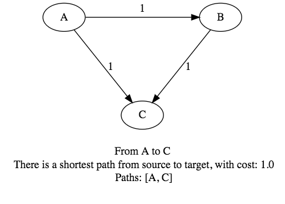

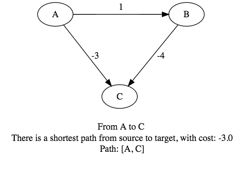

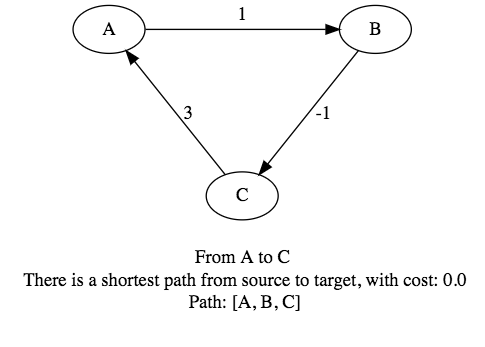

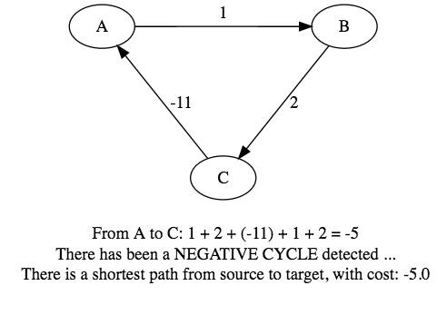


### DAG Shortest Path Algorithm
- DAG shortest path method: **O(E+V)**
- **Faster** than BellmanFord and Dijkstra
- **But NOT** able to use if **Negative Edge** and there is a **cycle in the graph**

```java
import java.util.ArrayList;
import java.util.List;
import java.util.Stack;
import java.util.Collections;

// DAG shortest path method: O(E+V)
// Faster than BellmanFord and Dijkstra
// But NOT able to use if negative edge and there is a cycle in the graph
public class AcyclicShortestPath {

  public void shortestPath(List<Vertex> vertexList, Vertex sourceVertex, Vertex targetVertex) {

    sourceVertex.setDistance(0);
    TopologicalSort topologicalSort = new TopologicalSort();
    topologicalSort.makeTopologicalOrder(vertexList);

    Stack<Vertex> stack = topologicalSort.getTopologicalOrder();

    for(Vertex actualVetex : stack) {

      for(Edge edge : actualVetex.getAdjaceciesList()) {

        Vertex u = edge.getStartVertex();
        Vertex v = edge.getTargetVertex();

        double newDistance = u.getDistance() + edge.getWeight();

        if(newDistance < v.getDistance()) {
          v.setDistance(newDistance);
          v.setPredecessor(u);
        }
      }
    }

    if(targetVertex.getDistance() == Double.MAX_VALUE)
      System.out.println("No shortest path there ... ");
    else
      System.out.println("Target vertex shortest path: " + targetVertex.getDistance());
  }

  public void showShortestsPathTo(Vertex targetVertex) {
    List<Vertex> list = new ArrayList<>();

    Vertex actualVetex = targetVertex;
    list.add(actualVetex);

    while(actualVetex.getPredecessor() != null) {
      actualVetex = actualVetex.getPredecessor();
      list.add(actualVetex);
    }

    Collections.reverse(list);
    System.out.println(list);
  }

  public static void main(String[] args) {
    List<Vertex> vertexList = new ArrayList<>();

    Vertex v0 = new Vertex("A");
    Vertex v1 = new Vertex("B");
    Vertex v2 = new Vertex("C");
    Vertex v3 = new Vertex("D");
    Vertex v4 = new Vertex("E");
    vertexList.add(v0);
    vertexList.add(v1);
    vertexList.add(v2);
    vertexList.add(v3);
    vertexList.add(v4);

    v0.addNeighour(new Edge(2,v0,v2));
    v0.addNeighour(new Edge(10,v0,v3));

    v1.addNeighour(new Edge(1,v1,v3));

    v2.addNeighour(new Edge(3,v2,v1));
    v2.addNeighour(new Edge(3,v2,v4));

    v4.addNeighour(new Edge(3,v4,v1));
    v4.addNeighour(new Edge(6,v4,v3));

    AcyclicShortestPath acyclicShortestPath = new AcyclicShortestPath();
    acyclicShortestPath.shortestPath(vertexList, v0, v3); // from A to D
    acyclicShortestPath.showShortestsPathTo(v3);

    /*
      Target vertex shortest path: 6.0
      [A, C, B, D]
    */
  }
}
```

#### <u>Output:</u>
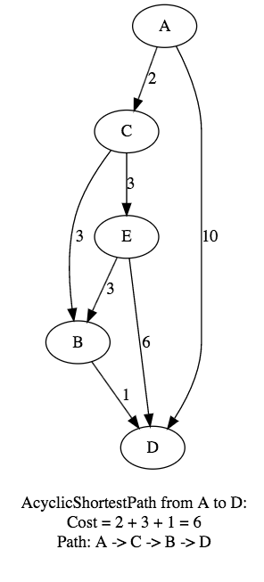
