# Spanning Trees

## Disjoint Set (Union-find data structure)
- Also known as union-find data structures
- Data structure to keep track of a set of elements partitioned into a number of disjoint (non overlapping) subsets
- Three main operations: **union** and **find** and **makeSet**
- Disjoint sets can be represented with the help of **linked lists** but usually we implemented as a tree like structure
- In **Kruskal algorithm (minimum-spanning-tree algorithm)** it will be useful: with disjoint sets we can decide in approximately **O(1)** time whether two vertices are in the same set or not

- So the make sets operation is quite easy to implement
- We set the parent of the given node to be itself
- Basically we create a distinct set to all the items/nodes

    ```ruby
      def makeSet(x)
        x.parent = x
    ```

- Serveral items can belong to the same set -> we ususally represent the set with one of its items:
  - **"Representative of the set"**
  - When we **search for an item** with **find()** then the operation is going to return with **the representative**
  ```ruby
    def find(x)
      if x.parent == x # Root node
        return x
      else
        return find(x.parent)
  ```

- Representative: 4
  - find(4) = 4
  - find(10) = 4
  - find(55) = 4

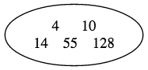


#### Union
- The union operation is **merge two disjoint sets** together by connecting them according to the representatives
  - PROBLEM: **this tree like structure can become unbalanced**

    ```ruby
      def union(x,y)
        xRoot = find(x)
        yRoot = find(y)

        xRoot.parent = yRoot
    ```
  - Fix:
    1. **Union by rank** -> always attach the smaller tree to the root of the larger one
        - the tree will become **more balanced: faster!!!**
    2. Path comperssion -> flattening the structure of hte tree
        - We set every visited node to be connected to the root directly!!!

- **Rank**
  - The rank of the set is equal to the rank of the representative// ~ the root node
  - We attack the smaller tree to the larger one -> it means we attack the tree with smallest rank to the tree with the highest rank!!!


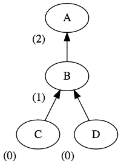


#### Path Compression

```ruby
def find(x)
  if x.parent != x # not the representative
    x.parent = find(x.parent)
  return x.parent
```

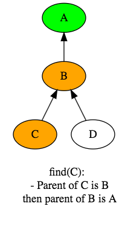

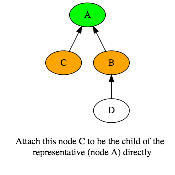

- Why is it good?
  - Because the next time, when I looking for the C, I can find it very easily and I can return the representative


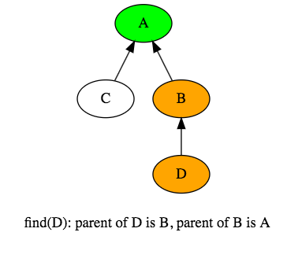

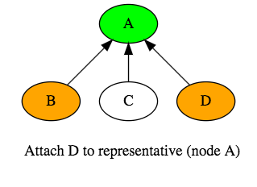

- Why is it good?
  - The next time we want to **find( C ) or find(D)** it will take **O(1)** time
  - Because they are the direct neighbour of the representative !!!
    - The algorithm will be faster because of the **"path compression"**

#### <u>Applications</u>
- It is used motly in **Kruskal-algorithm** implementation
- We have to check whether adding a given edge to the **MST (minimum spanning tree)** would form a cycle or not
- For checking this -> union-find data structure is extremely helpful
- We can check whether a cycle is present -> in asymtotically **O(1)** constant time complexity !!!


#### Union-find data structure illustration

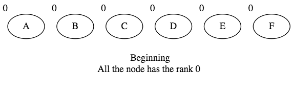

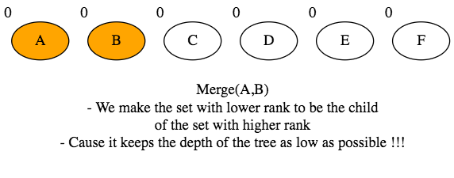

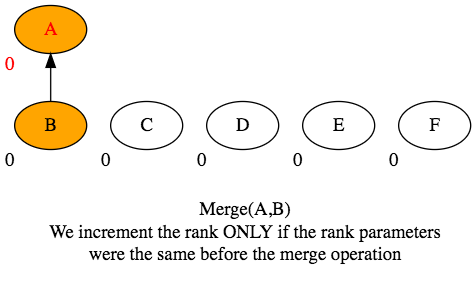

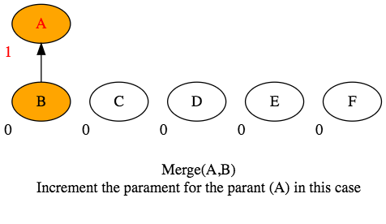

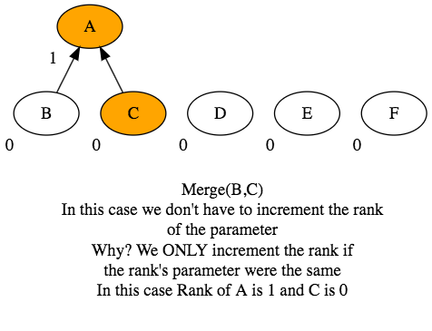

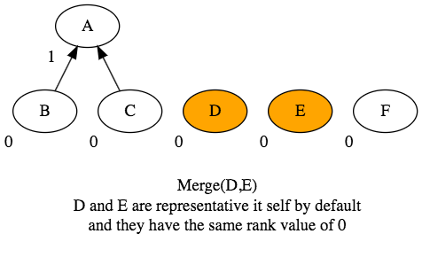

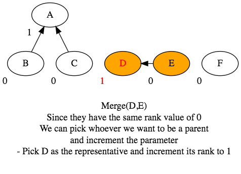

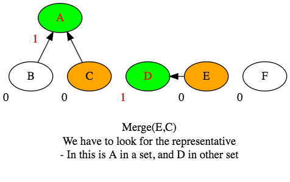

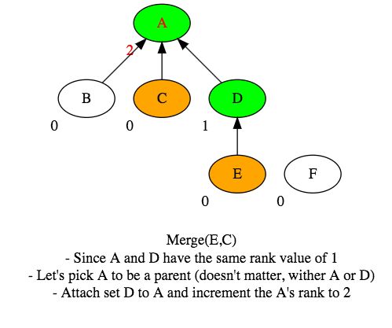

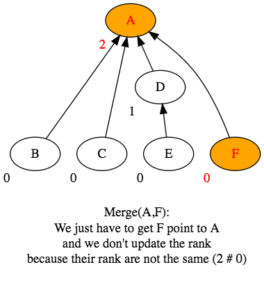

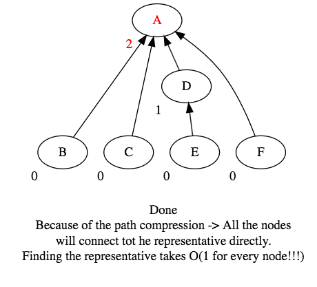

- **Because of the path compression -> All the nodes
will connect tot he representative directly.
Finding the representative takes O(1) for every node!!!)**


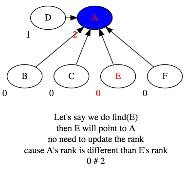

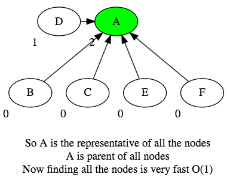


## Spanning Trees (Kruskal Algorithm)
- A spanning tree of an **undirected G graph** is a subgraph that includes all the vertices of **G**
- In general, a tree may have several spanning trees
- We can assign a weight to each edge
- A minimum spanning tree is then a spanning tree with weight less than or equal to the weight of every other spanning tree
- Has lots of applications: in big data analysis, clustering algorithms, finding minimum cost for a telecommumnications company laying cable to a new neighborhood
- Standard algorithms: **Prim's-Jarnik, Kruskal -> greddy algorithms**

- A graph may have several spanning tree
- usually we are looking for the minimum spanning tree: the spanning tree where the sum of edge weights is the lowest possible !!!

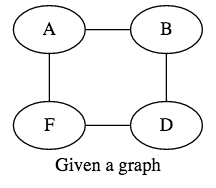

- <u>Spanning Tree:</u>


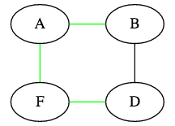
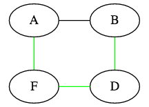
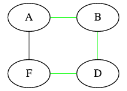


#### Kruskal-alogirthm
- We sort the edges according to their edge weights
- It can be done in **O(N * logN)** with mergesort or quicksort
- Union find data structure: **"disjoint set"**
  - We start adding edges to the MST and we want to make sure there will be no cycles in the spanning tree. It can be done in **O (E * log V)** with the help of union find data structure
    - We could use a heap instead sorting the edges in the beginning but the running time would be the same. So sometimes Krukal's algorithm is implemented with priority queues.

- Worst case running time: **O(E * logE)**, so we can use it for huge graphs too
- If the edges are sorted: the algorithm will be ** quasi-linear**
- If we multiply the weights with a constant or add a constant to the edge weights: the result will be the same
  - In physics, an invariant is a property of the system that remains unchanged under some transformation.
  - In Kruskal algorithm, spanning trees are invariant under the transformation of these weights (addition, multiplication)

- <u>Steps:</u>
  - **Given a graph with 7 vertices and 11 un-directed edges**

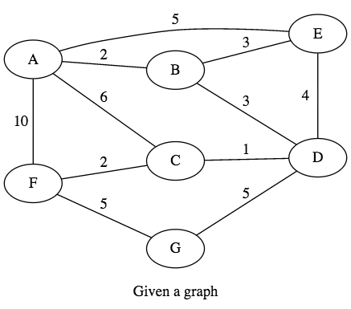


- **We have to sort the edges: 1,2,2,3,3,4,5,5,5,6,10**
- On every iteration we have to make sure whether by adding the new edge -> will there be a cycle or not ...
- <u>**Disjoint sets:**</u> at the beginning we have as many sets as the number of vertices. When adding an edge, we merge two sets together ...  **the algorithm stops when there is only a single set remains**


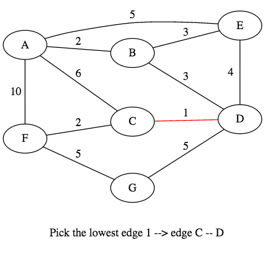

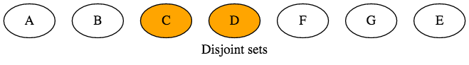

----

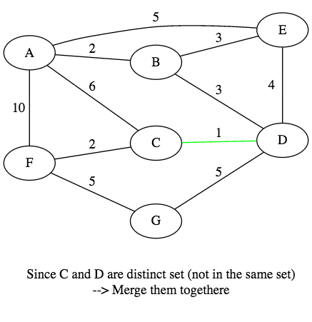

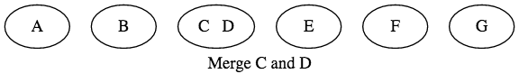


---

- **The edges: 1,[2],2,3,3,4,5,5,5,6,10**


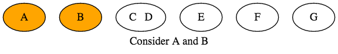


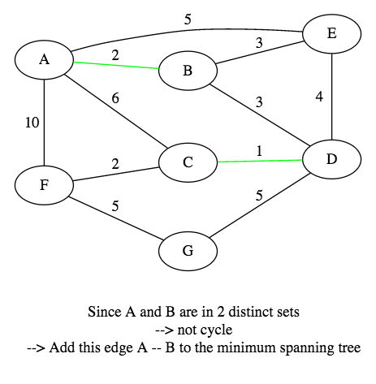

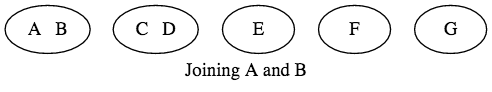

------

- **The edges: 1,2,[2],3,3,4,5,5,5,6,10**

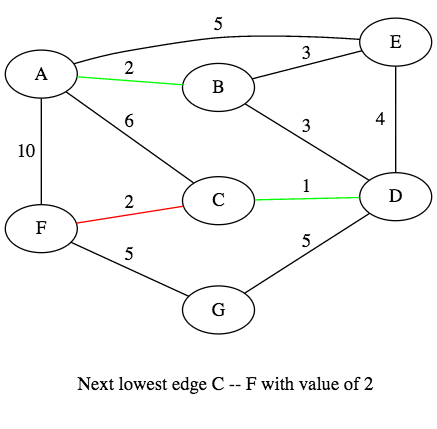

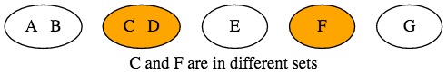

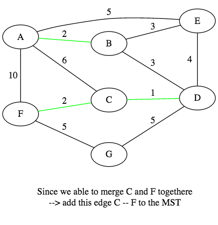

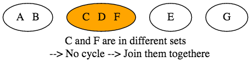

-----

- **The edges: 1,2,2,[3],3,4,5,5,5,6,10**

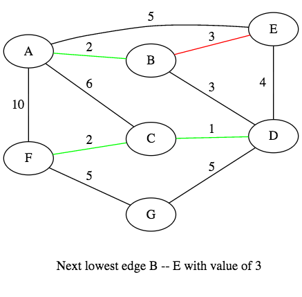

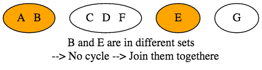

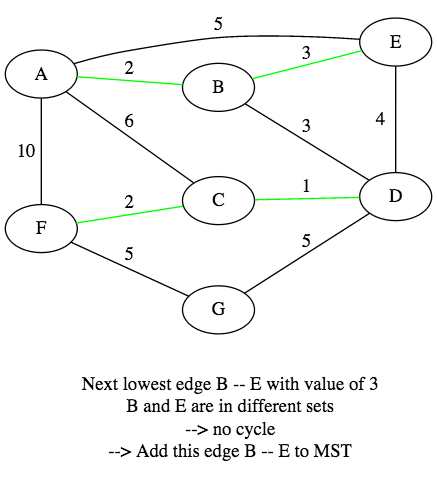

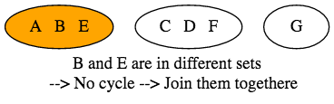


-----

- **The edges: 1,2,2,3,[3],4,5,5,5,6,10**

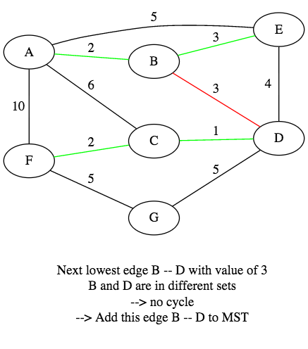

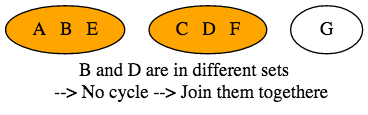

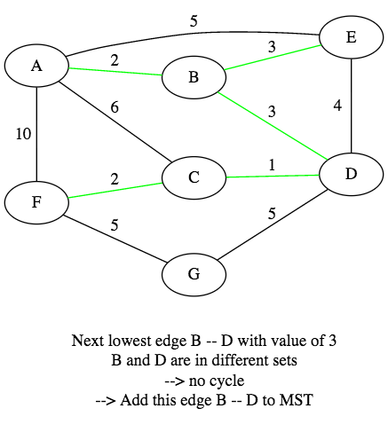

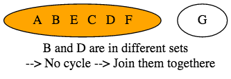


-----

- **The edges: 1,2,2,3,3,[4],5,5,5,6,10**

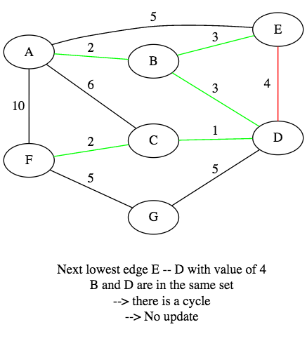

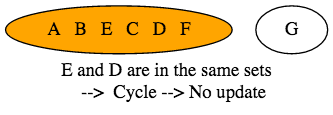

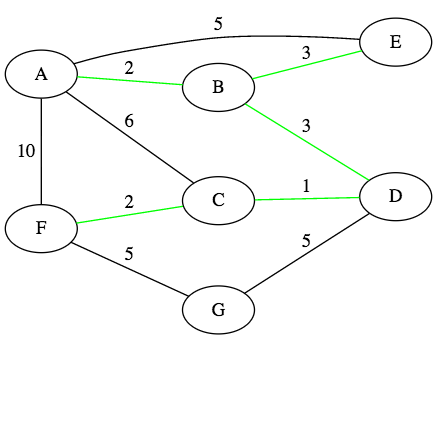


-----

- **The edges: 1,2,2,3,3,4,[5],5,5,6,10**

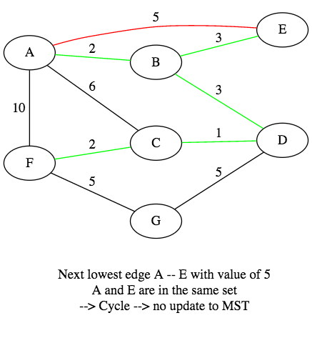

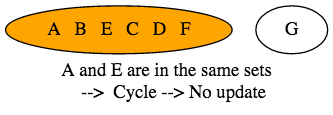

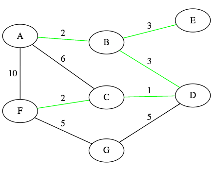


-----

- **The edges: 1,2,2,3,3,4,5,[5],5,6,10**

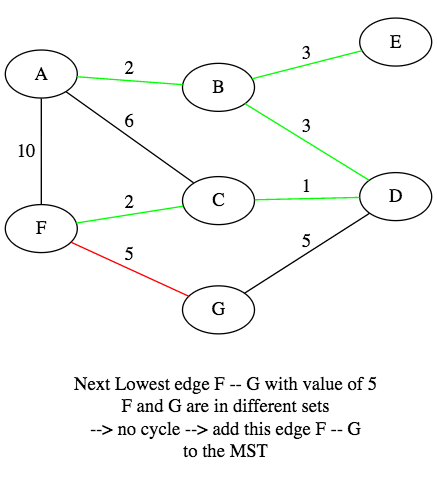


------

#### Kruskal Implementation

```java
public class Vertex {

  private String name;
  private Node node;

  public Vertex(String name) {
    this.name = name;
  }

  public void setNode(Node node) { this.node = node; }
  public Node getNode() { return this.node; }


  @Override
  public String toString() { return this.name; }
}
```

```java
public class Edge implements Comparable<Edge>{

  private double weight;
  private Vertex startVertex;
  private Vertex targetVertex;

  public Edge(Vertex startVertex, Vertex targetVertex, double weight) {
    this.weight = weight;
    this.startVertex = startVertex;
    this.targetVertex = targetVertex;
  }

  public double getWeigth() { return this.weight; }
  public void setWeight(double weight) { this.weight = weight; }

  public Vertex getStartVertex() { return this.startVertex; }
  public void setStartVertex(Vertex startVertex) { this.startVertex = startVertex; }

  public Vertex getTargetVertex() { return this.targetVertex; }
  public void setTargetVertex(Vertex weight) { this.targetVertex = targetVertex; }


  @Override
  public int compareTo(Edge otherEdge) {
    return Double.compare(this.weight, otherEdge.getWeigth());
  }

}
```

```java
public class Node {

  private int id;
  private int rank;
  private Node parent;

  public Node(int rank, int id, Node parent) {
    this.rank = rank;
    this.id = id;
    this.parent = parent;
  }

  public int getId() { return this.id; }
  public void setId(int id) { this.id = id; }

  public int getRank() { return this.rank; }
  public void setRank(int rank) { this.rank = rank; }

  public Node getParent() { return this.parent; }
  public void setParent(Node parent) { this.parent = parent; }
}
```

```java
import java.util.ArrayList;
import java.util.List;

public class DisjointSet {

  private int nodeCount = 0;
  private int setCount = 0; // track number of node(s)
  private List<Node> rootNodes; // list of sets

  public DisjointSet(List<Vertex> vertices) {
    this.rootNodes  = new ArrayList<Node>(vertices.size());
    makeSets(vertices);
  }

  public int find(Node n) {
    Node currentNode = n;

    // looking for the root node
    while(currentNode.getParent() != null) {
      currentNode = currentNode.getParent();
    }

    Node rootNode = currentNode;
    // make all the parent of node n point to the root node
    currentNode = n;
    while(currentNode != rootNode) {
      Node temp = currentNode.getParent();
      currentNode.setParent(rootNode);
      currentNode = temp;
    }

    return rootNode.getId(); // return the representative
  }

  public void union(Node node1, Node node2) {
    int index1 = find(node1);
    int index2 = find(node2);

    if(index1 == index2) // no need to merge them since they're in the same set
      return;

    Node root1 = this.rootNodes.get(index1);
    Node root2 = this.rootNodes.get(index2);

    if(root1.getRank() < root2.getRank()) {
      root1.setParent(root2);
    } else if(root1.getRank() > root2.getRank()) {
      root2.setParent(root1);
    } else {
      root2.setParent(root1);
      root1.setRank(root1.getRank() + 1);
    }

    // Since we join 2 sets, we need to decrease the number of set by 1
    this.setCount--;
  }

  private void makeSets(List<Vertex> vertices) {
    for(Vertex v : vertices)
      makeSet(v);
  }

  private void makeSet(Vertex vertex) {
    Node n = new Node(0, rootNodes.size(), null);
    vertex.setNode(n);
    this.rootNodes.add(n);
    this.setCount++;
    this.nodeCount++;
  }
}
```

```java
import java.util.ArrayList;
import java.util.List;
import java.util.Collections;

// O(E * logV), worcase :  O(E * logE)
public class Kruskal {

  public void spanningTree(List<Vertex> vertices, List<Edge> edges) {
    DisjointSet disjointSet = new DisjointSet(vertices);

    List<Edge> mst = new ArrayList<Edge>();

    Collections.sort(edges); // sort the edges by its weight

    for(Edge edge : edges) {
      Vertex u = edge.getStartVertex();
      Vertex v = edge.getTargetVertex();

      // they're in different set, --> No Cycle, and can be added to the MST list
      if(disjointSet.find(u.getNode()) != disjointSet.find(v.getNode())) {
        mst.add(edge);
        disjointSet.union(u.getNode(), v.getNode()); // join the 2 node togethere
      }
    }

    double cost = 0;
    for(Edge edge : mst) {
      Vertex u = edge.getStartVertex();
      Vertex v = edge.getTargetVertex();
      System.out.print(u + " " + v + " -- ");
      cost += edge.getWeigth();
    }
    System.out.println("Cost = " + cost);
  }

  public static void main(String[] args) {
    List<Vertex> vertices = new ArrayList<>();
		Vertex v1 = new Vertex("A"); vertices.add(v1);
		Vertex v2 = new Vertex("B"); vertices.add(v2);
		Vertex v3 = new Vertex("C"); vertices.add(v3);
		Vertex v4 = new Vertex("D"); vertices.add(v4);
		Vertex v5 = new Vertex("E"); vertices.add(v5);
		Vertex v6 = new Vertex("F"); vertices.add(v6);
		Vertex v7 = new Vertex("G"); vertices.add(v7);

		List<Edge> edges = new ArrayList<>();
    Edge e1 = new Edge(v1,v2,2); edges.add(e1); // A -- B : 2
    Edge e2 = new Edge(v1,v3,6); edges.add(e2); // A -- C : 6
    Edge e3 = new Edge(v1,v5,5); edges.add(e3); // A -- E : 5
    Edge e4 = new Edge(v1,v6,10); edges.add(e4);// A -- F : 10
    Edge e5 = new Edge(v2,v5,3); edges.add(e5); // B -- E : 3
    Edge e6 = new Edge(v2,v4,3); edges.add(e6); // B -- D : 3
    Edge e7 = new Edge(v3,v4,1); edges.add(e7); // C -- D : 1
    // Edge e8 = new Edge(v3,v5,2); edges.add(e8);
    Edge e8 = new Edge(v5,v4,4); edges.add(e8); // E -- D : 4
    Edge e9 = new Edge(v6,v7,5); edges.add(e9); // F -- G: 5
    Edge e10 = new Edge(v6,v3,2); edges.add(e10); // F -- C: 2
    Edge e11 = new Edge(v7,v4,5); edges.add(e11); // G -- D: 5

		Kruskal kruskal = new Kruskal();
		kruskal.spanningTree(vertices, edges);
  }
}
```


## Prims Algorithm
- In Kruskal implementation we build the spanning tree separately, adding the smallest edge to the spanning tree if there is no cycle
- In Prims algorithm we build the spanning tree from a given vertex adding the samllest edge to the MST
- **Kruskal -> edge based** better if number of edges is not high
- **Prims -> vertex based !!!** better if many more edges than vertices (dense graph)
- There are two implementations: **lazy and eager**
- **Lazy implementation:** add the new neighbour edges to the heap without deleting its content
- **Eager implementation:** we keep updating the heap if the distance from a vertex to the MST has changed
- Average running time: **O(E * logE)** but we need additional memory space **O(E)**
- Worst case: **O(E * logV)**

- <u>Steps:</u>
  - **Edge F-G is 3, not 5**


---------

  - **Edge F-G is 3, not 5**


---------

  - **Edge F-G is 3, not 5**


---------

  - **Edge F-G is 3, not 5**


---------

  - **Edge F-G is 3, not 5**


---------

  - **Edge F-G is 3, not 5**


---------

  - **Edge F-G is 3, not 5**


---------

  - **Edge F-G is 3, not 5**


- **Add BA-2 to the MST**

---------

  - **Edge F-G is 3, not 5**


---------

- **Edge F-G is 3, not 5**


---------


### Prims VS Kruskal
- **Prim's algorithm** is significantly faster in the limite when you've got a **really dense graph with many more edges than vertices**
- **Kruskal** performs bettern in typical situations **(sparse graphs)** because it **uses simpler data structures**
- **Kruskal** can have better performance if the edges can be sorted in lnear time or the edges are already sorted
- **Prim's** better if **the number of edges to vertices is high (dense graphs)**


#### Prims Implementation:

```java
import java.util.ArrayList;
import java.util.List;

public class Vertex {

  private String name;
  private boolean visited;
  private List<Edge> adjaceciesList;

  public Vertex(String name) {
    this.name = name;
    this.adjaceciesList = new ArrayList<>();
  }

  public void addEdge(Edge edge) { adjaceciesList.add(edge); }

  public List<Edge> getAdjaceciesList() { return adjaceciesList; }

  public void setVisited(boolean visited) { this.visited = visited; }
  public boolean isVisited() { return this.visited; }

  @Override
  public String toString() { return this.name; }
}
```

```java
public class Edge implements Comparable<Edge>{

  private double weight;
  private Vertex startVertex;
  private Vertex targetVertex;

  public Edge(Vertex startVertex, Vertex targetVertex, double weight) {
    this.weight = weight;
    this.startVertex = startVertex;
    this.targetVertex = targetVertex;
  }

  public double getWeigth() { return this.weight; }
  public void setWeight(double weight) { this.weight = weight; }

  public Vertex getStartVertex() { return this.startVertex; }
  public void setStartVertex(Vertex startVertex) { this.startVertex = startVertex; }

  public Vertex getTargetVertex() { return this.targetVertex; }
  public void setTargetVertex(Vertex weight) { this.targetVertex = targetVertex; }

  @Override
  public int compareTo(Edge otherEdge) {
    return Double.compare(this.weight, otherEdge.getWeigth());
  }
}
```

```java
import java.util.ArrayList;
import java.util.List;
import java.util.PriorityQueue;

public class PrimLazy {
  private List<Vertex> unVisitedVertices;
  private List<Edge> spanningTree;
  private PriorityQueue<Edge> edgeHeap;
  private double fullCost;

  public PrimLazy(List<Vertex> unVisitedVertices) {
    this.spanningTree = new ArrayList<>();
    this.unVisitedVertices = unVisitedVertices; // list of all vertices by default
    this.edgeHeap = new PriorityQueue<>();
  }

  // start at any random vertex
  public void primsAlgorithm(Vertex vertex) {
    this.unVisitedVertices.remove(vertex);

    while(!unVisitedVertices.isEmpty()) {

      for(Edge edge : vertex.getAdjaceciesList()) {
        if(this.unVisitedVertices.contains(edge.getTargetVertex())) {
          // This is called because it hasn't modified any content
          // in the heap, just only add and remove
          this.edgeHeap.add(edge);
        }
      }

      Edge minEdge = this.edgeHeap.remove();

      this.spanningTree.add(minEdge);
      this.fullCost += minEdge.getWeigth();

      // visiting this vertex's neighbours in the next iteration
      vertex = minEdge.getTargetVertex(); // for next iteration
      this.unVisitedVertices.remove(vertex);
    }
  }

  public void showMST() {
    System.out.println("The minimum spanningTree cost = " + this.fullCost);

    for(Edge edge : spanningTree)
      System.out.print(edge.getStartVertex() + "  " + edge.getTargetVertex() + " - " + edge.getWeigth() + ", ");
  }

  public static void main(String[] args) {
    List<Vertex> unVisitedVertices = new ArrayList<>();
    Vertex v1 = new Vertex("A"); unVisitedVertices.add(v1);
    Vertex v2 = new Vertex("B"); unVisitedVertices.add(v2);
    Vertex v3 = new Vertex("C"); unVisitedVertices.add(v3);
    Vertex v4 = new Vertex("D"); unVisitedVertices.add(v4);
    Vertex v5 = new Vertex("E"); unVisitedVertices.add(v5);
    Vertex v6 = new Vertex("F"); unVisitedVertices.add(v6);
    Vertex v7 = new Vertex("G"); unVisitedVertices.add(v7);

    Edge e1 = new Edge(v1,v2,2); v1.addEdge(e1); // A -- B : 2
    Edge e2 = new Edge(v1,v3,6); v1.addEdge(e2); // A -- C : 6
    Edge e3 = new Edge(v1,v5,5); v1.addEdge(e3); // A -- E : 5
    Edge e4 = new Edge(v1,v6,10); v1.addEdge(e4); // A -- F : 10
    Edge e5 = new Edge(v2,v5,3); v2.addEdge(e5); // B -- E : 3
    Edge e6 = new Edge(v2,v4,3); v2.addEdge(e6); // B -- D : 3
    Edge e7 = new Edge(v3,v4,1); v3.addEdge(e7); // C -- D : 1
    Edge e8 = new Edge(v5,v4,4); v5.addEdge(e8); // E -- D : 4
    Edge e9 = new Edge(v6,v7,3); v6.addEdge(e9); // F -- G: 3
    Edge e10 = new Edge(v6,v3,2); v6.addEdge(e10); // F -- C: 2
    Edge e11 = new Edge(v7,v4,5); v7.addEdge(e11); // G -- D: 5

  // Making Un-directed graph by adding both direction  A->B, B->A
    Edge e1a = new Edge(v2,v1,2); v2.addEdge(e1a); // A -- B : 2
    Edge e2a = new Edge(v3,v1,6); v3.addEdge(e2a); // A -- C : 6
    Edge e3a = new Edge(v5,v1,5); v5.addEdge(e3a); // A -- E : 5
    Edge e4a = new Edge(v6,v1,10); v6.addEdge(e4a); // A -- F : 10
    Edge e5a = new Edge(v5,v2,3); v5.addEdge(e5a); // B -- E : 3
    Edge e6a = new Edge(v4,v2,3); v4.addEdge(e6a); // B -- D : 3
    Edge e7a = new Edge(v4,v3,1); v4.addEdge(e7a); // C -- D : 1
    Edge e8a = new Edge(v4,v5,4); v4.addEdge(e8a); // E -- D : 4
    Edge e9a = new Edge(v7,v6,3); v7.addEdge(e9a); // F -- G: 3
    Edge e10a = new Edge(v3,v6,2); v3.addEdge(e10a); // F -- C: 2
    Edge e11a = new Edge(v4,v7,5); v4.addEdge(e11a); // G -- D: 5

    PrimLazy primLazy = new PrimLazy(unVisitedVertices);
    primLazy.primsAlgorithm(v4);// pick a random vertex
    primLazy.showMST();// pick a random vertex
  }
}
```


