# Strongly Connected Components (SCC)
- Connected graph -> a graph is connected if all its vertices are connected
- A graph is **strongly connected** if we can get from any vertex to any other vertex (undirected graphs are stronly connected by definition)
- In directed graphs there are vertices that connot be reached from everywhere
- These clusters can be discovered with **DFS**
- We can find the strongly connected components of a graph in **O(V)** time
- If we shrink each component to a vertex these vertices form a **DAG**, this is the **"condensation"** of the given graph
- So a directed graph is a **DAG** only if there is no subgraph that is strongly connected

- Example:

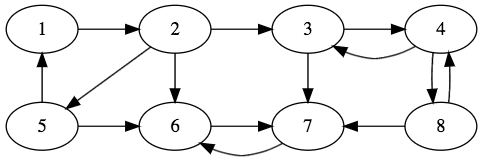

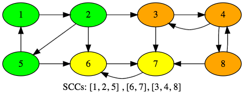

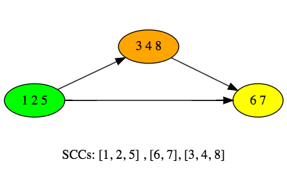


-----

- A directed cycle is trongly connected
- Every non-trivial strongly connected component contains at least one directed cycle
- **Kosaraju algorithm:** does two **DFSs**, one to get the topological ordering and then on the transposed graph to discover the strongly connected components
  - Transopose of a graph: we reverse each edges -> change he start and end vertex
- **Tarjan algorithm:** it uses only on **DFS** so it is much more popular in practice

#### Applications:
- **<u>Ecology</u>** : to determine the hierarchy of food need
- **<u>Software enginnering</u>**: if we have a huge software and want to create packages to each connected classes we can classify according to the strongly connected components
- **<u>Astrophysics</u>**: If we ahve an image of faint stars and wan tot detect each of them .. it is a good way of finding the clusters !!!
- **<u>Recommender systems: </u>** for example youtube videos
  - We can recommend anothe ritem from the same strongly connected components / cluster !!!

-----
## Kosaraju Algorithm
- We have to use a stack for DFS traversal because we have to track the finishing times
- We need to track whether we have already visited a given node or not
  1. Do a DFS on the original graph and keep pushing the nodes to the stack
  2. Transpose the graph -> reverse the edges
  3. Keep popping the noes from the stack, keep constructing the strongly connected components

- **<u>Step:</u>**
  - **Notes: Visited Set,  Not Visited Stack**

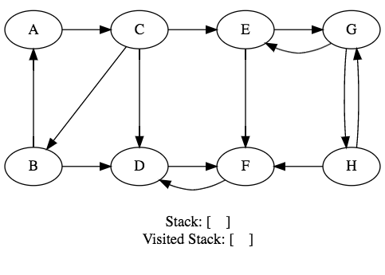


- **Notes: Visited Set,  Not Visited Stack**

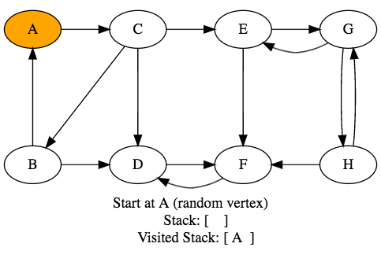


- **Notes: Visited Set,  Not Visited Stack**

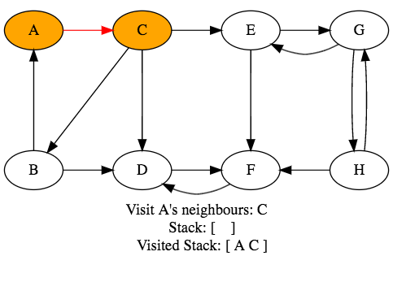

- **Notes: Visited Set,  Not Visited Stack**

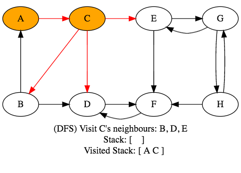

- **Notes: Visited Set,  Not Visited Stack**

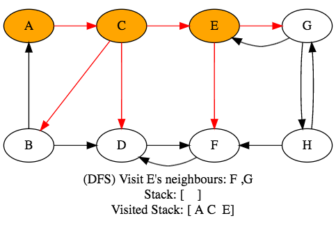

- **Notes: Visited Set,  Not Visited Stack**

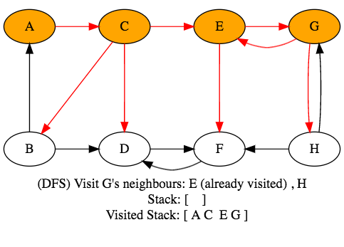

- **Notes: Visited Set,  Not Visited Stack**

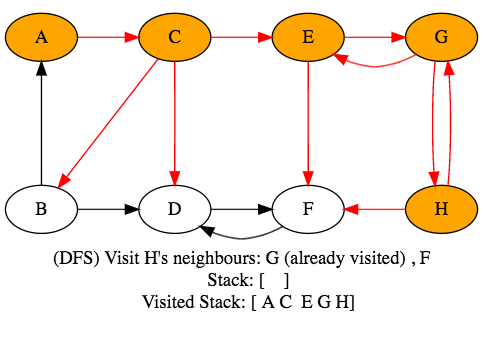

- **Notes: Visited Set,  Not Visited Stack**

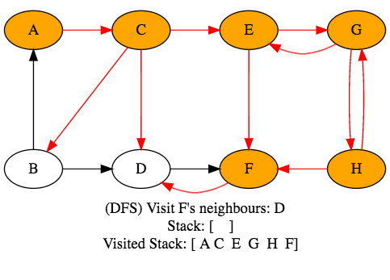

- **Notes: Visited Set,  Not Visited Stack**

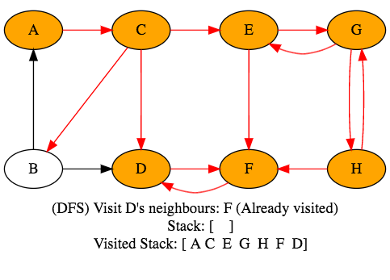

- **Notes: Visited Set,  Not Visited Stack**

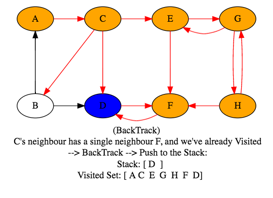


- **Notes: Visited Set,  Not Visited Stack**

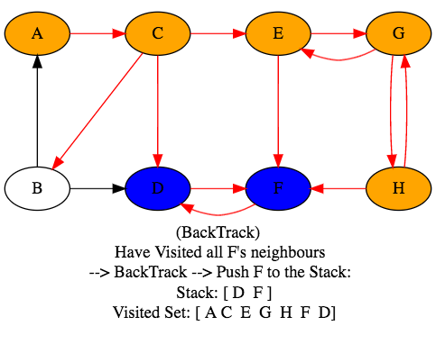

- **Notes: Visited Set,  Not Visited Stack**

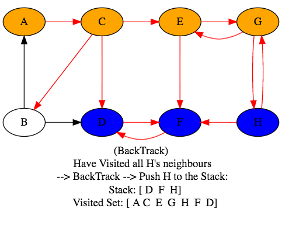

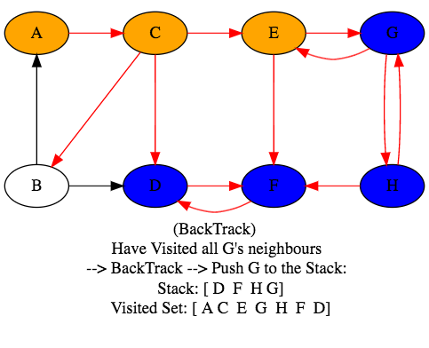

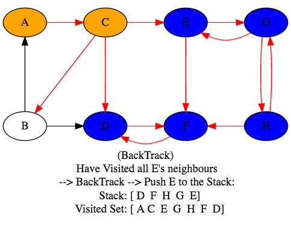

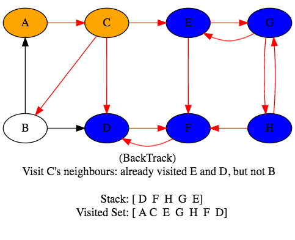

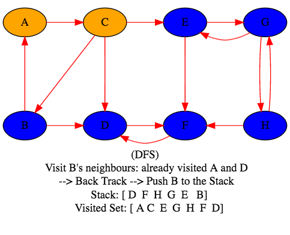

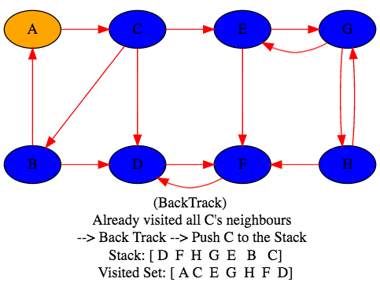

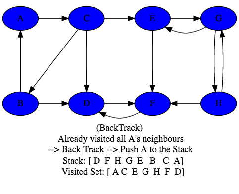

-------
-------

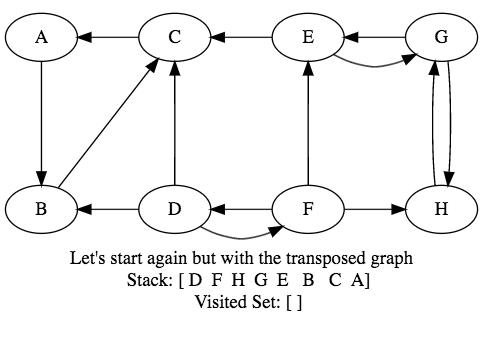

-------

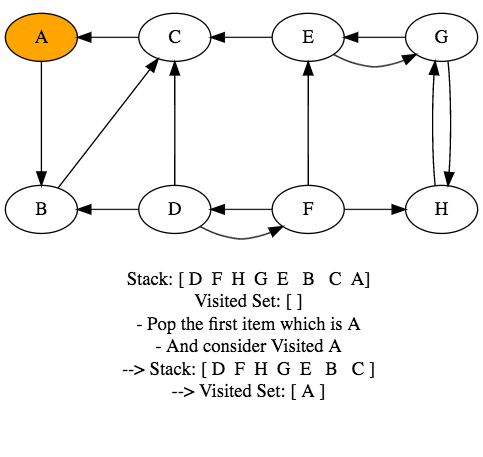

-------

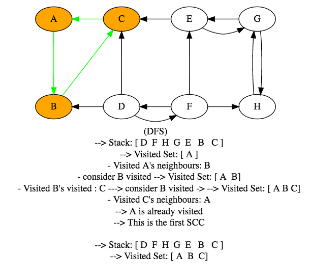

-------

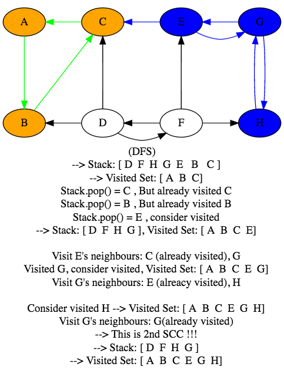

-------

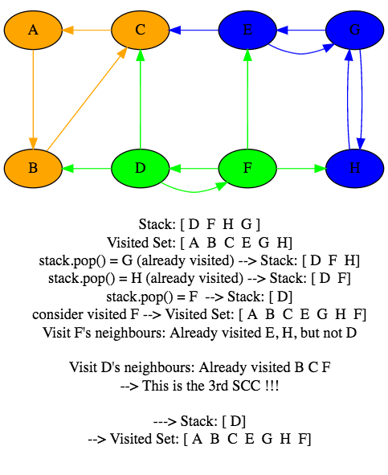

-------

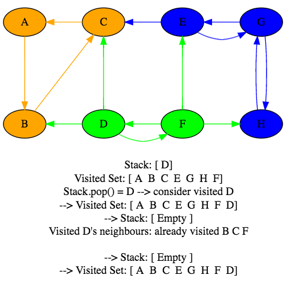

-------

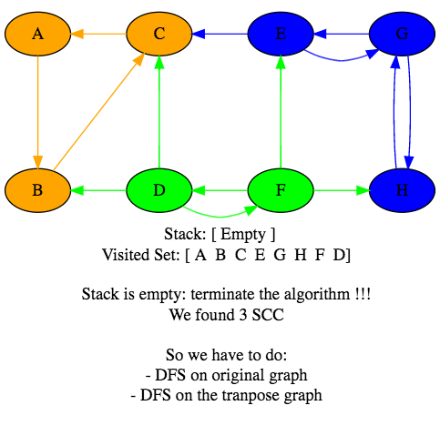

-------

### Kosaraju Algorithm Implemtation

```java
import java.util.ArrayList;
import java.util.List;

public class Vertex {

  private int id; // each vertex has an ID, ex: vertex #1,2,3
  private String name;
  private List<Vertex> adjaceciesList;
  private boolean visited;
  private int componentId; // this is SCC id --> ex: vertex 1 has SCC #3

  public Vertex(int id, String name) {
    this.id = id;
    this.name = name;
    this.adjaceciesList = new ArrayList<>();
  }

  public void addNeighour(Vertex vertex) {
    this.adjaceciesList.add(vertex);
  }

  public int getId() { return id; }
  public void setId(int id) { this.id = id; }

  public int getComponentId() { return componentId; }
  public void setComponentId(int componentId) { this.componentId = componentId; }

  public String getName() { return name; }
  public void setName(String name) { this.name = name; }

  public List<Vertex> getAdjaceciesList() { return adjaceciesList; }
  public void setAdjaceciesList(List<Vertex> adjaceciesList) { this.adjaceciesList = adjaceciesList; }

  public boolean isVisited() { return visited; }
  public void setVisited(boolean visited) { this.visited = visited; }

  @Override
  public String toString(){ return this.name; }

}
```

```java
public class Edge {
  private double weight;
  private Vertex startVertex;
  private Vertex targetVertex;

  public Edge(double weight, Vertex startVertex, Vertex targetVertex) {
    this.weight = weight;
    this.startVertex = startVertex;
    this.targetVertex = targetVertex;
  }

  public double getWeight() { return weight; }
  public void setWeight(double weight) { this.weight = weight; }

  public Vertex getStartVertex() { return startVertex; }
  public void setStartVertex(Vertex startVertex) { this.startVertex = startVertex; }

  public Vertex getTargetVertex() { return targetVertex; }
  public void setTargetVertex(Vertex targetVertex) { this.targetVertex = targetVertex; }
}
```

```java
import java.util.ArrayList;
import java.util.List;

public class Graph {

  private List<Vertex> vertices;
  private List<Edge> edges;

  public Graph() { }

  public Graph(List<Vertex> vertices, List<Edge> edges) {
    this.vertices = vertices;
    this.edges = edges;
  }

  public List<Vertex> getVertexList() { return vertices; }
  public void setVertexList(List<Vertex> vertices) { this.vertices = vertices; }

  public List<Edge> getEdgeList() { return edges; }
  public void setEdgeList(List<Edge> edges) { this.edges = edges; }

  public Graph getTransposeGraph() {
    Graph tranposed = new Graph();

    List<Vertex> tranposedVertexList = new ArrayList<>();

    for(Vertex vertex : this.vertices)
      tranposedVertexList.add(vertex);

    for(Edge edge : this.edges) {
      Vertex start = edge.getStartVertex();
      Vertex target = edge.getTargetVertex();
      Vertex startTranposed = tranposedVertexList.get(tranposedVertexList.indexOf(target));

      startTranposed.addNeighour(start);
    }

    tranposed.setVertexList(tranposedVertexList);
    return tranposed; // Tranposed Graph
  }
}
```

```java
import java.util.Stack;

// Do 1st DFS, load to the Stack
public class DepthFirstOrder {

  private Stack<Vertex> stack;

  public DepthFirstOrder(Graph graph) {
    stack = new Stack<>();

    for(Vertex vertex : graph.getVertexList())
      if(!vertex.isVisited())
        dfs(vertex);
  }

  private void dfs(Vertex vertex) {
    vertex.setVisited(true);

    for(Vertex v : vertex.getAdjaceciesList())
      if (!v.isVisited())
        dfs(v);
    stack.push(vertex);
  }

  public Stack<Vertex> getReversePost() { return this.stack; }
}
```

```java
import java.util.ArrayList;
import java.util.List;
import java.util.Stack;


// 2 DFS take +  tranpose the graph, which reverse all edges direction
// = O(2(V + E)) + O(E) = 2V + 3E = O(V + E)
public class KosarajuAlgorithm {

  // id[v] = id of the SCC conntaining that given vertex
  private int[] id;
  private int count; // number of SCCs
  private boolean[] visitedSet;

  public KosarajuAlgorithm(Graph graph) {

    // Do 1st DFS, load to the Stack
    DepthFirstOrder dfs = new DepthFirstOrder(graph.getTransposeGraph());

    Stack<Vertex> stack = dfs.getReversePost();

    visitedSet = new boolean[graph.getVertexList().size()];
    id = new int[graph.getVertexList().size()];

    // pop from stack, this is 1st current vertex of current SCC
    for(Vertex vertex: stack) {
      if(!visitedSet[vertex.getId()]) {
        dfs(vertex); // call DFS on this current vertex
        count++;
      }
    }
  }

  // assign SSC id to the vertices of current SCC
  private void dfs(Vertex vertex) {
    visitedSet[vertex.getId()] = true;
    id[vertex.getId()] = count;
    vertex.setComponentId(count);

    for(Vertex v : vertex.getAdjaceciesList())
      if(!visitedSet[v.getId()])
        dfs(v);
  }

  public int getCount() { return this.count; }


  public static void main(String[] args) {
    List<Vertex> vertexList = new ArrayList<>();

		vertexList.add(new Vertex(0, "a"));
		vertexList.add(new Vertex(1, "b"));
		vertexList.add(new Vertex(2, "c"));
		vertexList.add(new Vertex(3, "d"));
		vertexList.add(new Vertex(4, "e"));
		vertexList.add(new Vertex(5, "f"));
		vertexList.add(new Vertex(6, "g"));
		vertexList.add(new Vertex(7, "h"));

    // All edges's weight is 1
		List<Edge> edgeList = new ArrayList<Edge>();

		edgeList.add(new Edge(1, vertexList.get(0), vertexList.get(1)));

		edgeList.add(new Edge(1, vertexList.get(1), vertexList.get(2)));
		edgeList.add(new Edge(1, vertexList.get(1), vertexList.get(4)));
		edgeList.add(new Edge(1, vertexList.get(1), vertexList.get(5)));

		edgeList.add(new Edge(1, vertexList.get(2), vertexList.get(3)));
		edgeList.add(new Edge(1, vertexList.get(2), vertexList.get(6)));

		edgeList.add(new Edge(1, vertexList.get(3), vertexList.get(2)));
		edgeList.add(new Edge(1, vertexList.get(3), vertexList.get(7)));

		edgeList.add(new Edge(1, vertexList.get(4), vertexList.get(0)));
		edgeList.add(new Edge(1, vertexList.get(4), vertexList.get(5)));

		edgeList.add(new Edge(1, vertexList.get(5), vertexList.get(6)));

		edgeList.add(new Edge(1, vertexList.get(6), vertexList.get(5)));

		edgeList.add(new Edge(1, vertexList.get(7), vertexList.get(3)));
		edgeList.add(new Edge(1, vertexList.get(7), vertexList.get(6)));


		Graph graph = new Graph(vertexList,edgeList);

    KosarajuAlgorithm kosarajuAlgorithm = new KosarajuAlgorithm(graph);

		System.out.println(kosarajuAlgorithm.getCount());

		for(Vertex vertex : vertexList){
			System.out.println(vertex+" - "+vertex.getComponentId());
		}
  }
}
/*
3
a - 0
b - 0
c - 1
d - 1
e - 0
f - 2
g - 2
h - 1
*/
```

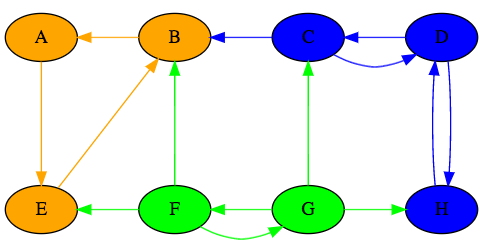
